# Big-O, the honest way

Imagine you're washing dishes. If washing one plate takes a minute, washing 10
plates takes 10 minutes. Double the plates, double the time. That's **linear
growth** — O(n). Big-O is nothing more than the answer to one question:

> **When the input gets bigger, how much worse does my algorithm get?**

That's it. Not "how fast is it on my laptop" — how does it *scale*.

## The growth families you'll actually meet

| Big-O | Nickname | Everyday picture | n = 1,000,000 |
|---|---|---|---|
| O(1) | constant | grabbing the top plate | 1 step |
| O(log n) | logarithmic | guessing a number by halving | ~20 steps |
| O(n) | linear | washing every plate | 10⁶ steps |
| O(n log n) | linearithmic | good sorting | ~2×10⁷ steps |
| O(n²) | quadratic | comparing every plate to every other | 10¹² steps — **too slow** |
| O(2ⁿ) | exponential | trying every subset | forget it past n≈25 |

```mermaid
graph LR
    A["O(1)"] --> B["O(log n)"] --> C["O(n)"] --> D["O(n log n)"] --> E["O(n²)"] --> F["O(2ⁿ)"]
    style A fill:#1f3d2e,stroke:#2ecc8f
    style B fill:#1f3d2e,stroke:#2ecc8f
    style C fill:#1f3d2e,stroke:#2ecc8f
    style D fill:#3d3420,stroke:#f5b942
    style E fill:#3d2022,stroke:#f4595e
    style F fill:#3d2022,stroke:#f4595e
```

## The interview superpower: budget math

Online judges (and interviewers) run roughly **10⁷–10⁸ simple Python
operations per second**. So read the constraint and do this arithmetic *before
designing anything*:

- n ≤ 10⁵ → n² = 10¹⁰ → quadratic dies → you need O(n log n) or O(n)
- n ≤ 1,000 → n² = 10⁶ → quadratic is fine, don't over-engineer
- n ≤ 20 → 2ⁿ ≈ 10⁶ → brute force / bitmask is *intended*

Saying this out loud — "n is 10⁵, so I need better than quadratic" — is a
senior signal. It shows you design against the constraints, not by habit.

## Rules for computing it

1. **Drop constants.** O(2n) = O(n). Big-O is about the *shape* of growth.
2. **Keep the dominant term.** O(n² + n) = O(n²).
3. **Sequential steps add; nested steps multiply.** A loop inside a loop over
   the same n → n·n. Two loops one after another → n + n.
4. **Different inputs get different letters.** Comparing every word (n) against
   every character of a pattern (m) is O(n·m), never "O(n²)".

## Space complexity

Same idea, for memory. Count what you *allocate*, not what you were given:
a visited set over n nodes is O(n) space; two pointer variables are O(1).
Recursion counts too — the call stack of a depth-d recursion is O(d) space.
A balanced tree gives d = log n; a degenerate chain gives d = n. Interviewers
love asking which.

## Amortized: the "on average per operation" trick

Appending to a Python list is *usually* O(1), but occasionally the list
resizes and copies everything — O(n). Spread over n appends, the total is
still O(n), so we say **amortized O(1)**. Same story for dict/set inserts.
The word to say out loud: "worst case for one call, but amortized constant."

## Python cheat facts (memorize these)

- `list.append`, `pop()` from end, `dict`/`set` get/put: amortized O(1)
- `x in list`: O(n) — **`x in set`: O(1)**. This one line fixes half of all TLEs.
- `list.pop(0)`: O(n) — use `collections.deque` (O(1) both ends)
- `sorted(xs)`: O(n log n), Timsort, stable
- `heapq.heappush/pop`: O(log n); `heapify`: O(n)
- String concatenation in a loop: O(n²) — build a list, `''.join` at the end

## The one-line spoken justification

Interviewers don't want a proof; they want a sentence tying cost to structure:

> "Each element enters and leaves the window at most once, so the whole pass
> is O(n) even though there's a nested while."

Practice ending every problem with exactly one sentence like that.
