# How to run an interview

A coding interview isn't a test you take; it's a meeting you *run*. Picture a
contractor asked to build a deck: a junior grabs a hammer; a senior asks about
the soil, the budget, and the permit — then sketches, then builds, then walks
the client around it. Interviewers at Snowflake and Google are trained to
score the *process*, and at the senior (L5) bar the process **is** the
product: ambiguity handling, communication, and testing discipline are
explicit rubric lines, not niceties.

Here is the protocol, phase by phase.

```mermaid
flowchart TD
    A[Hear the problem] --> B[Clarify: bounds, empties,<br/>dupes, types, mutation]
    B --> C[Restate in one sentence<br/>+ tiny example]
    C --> D[Brute force first —<br/>state it, price it]
    D --> E[Constraint math →<br/>target complexity]
    E --> F{Gap between<br/>brute & target?}
    F -->|yes| G[Name the pattern that<br/>closes the gap]
    F -->|no| H[Brute force IS the answer]
    G --> I[Get a nod, then code<br/>while narrating]
    H --> I
    I --> J[Test out loud:<br/>trace + edge cases]
    J --> K[State complexity,<br/>offer follow-ups]
    style A fill:#1f3d2e,stroke:#2ecc8f
    style K fill:#1f3d2e,stroke:#2ecc8f
    style F fill:#3d3420,stroke:#f5b942
```

## Phase 1 — Clarify (2–3 minutes, not ten)

Interview problems are *deliberately* underspecified — the ambiguity is part
of the test. Ask questions whose answers would change your code:

- **Bounds:** "How large can n get? Value ranges? Can values be negative?"
  This isn't politeness — the answer decides your algorithm (n ≤ 20 means
  brute force is intended; n ≤ 10⁵ kills quadratic).
- **Empties and degenerates:** empty array, single element, empty string,
  null root. "What should I return for an empty input?"
- **Duplicates:** allowed? Do they change the answer's definition?
- **Types:** integers only? Unicode or lowercase ASCII? Sorted already?
- **Mutation:** "May I modify the input in place?" — sometimes it unlocks
  O(1) space, and asking shows you know the difference.

Don't interrogate every axis every time; ask the two or three that matter for
*this* problem. A question with no consequence for your solution is noise.

## Phase 2 — Restate and anchor

One sentence, in your own words, plus a tiny example:

> "So: given intervals sorted by start, insert a new one and merge overlaps —
> for [[1,3],[6,9]] with [2,5], I should return [[1,5],[6,9]]. Right?"

Ten seconds. It catches misunderstandings while they cost nothing, and gives
you a worked example you'll reuse when testing. Skipping this is how people
solve the wrong problem flawlessly.

## Phase 3 — Brute force FIRST, with a price tag

Always state the naive approach before the clever one, even when you already
see the clever one:

> "Brute force: try every pair — O(n²). With n up to 10⁵ that's 10¹⁰
> operations, too slow, so I need roughly O(n log n) or better."

Three things just happened. You banked a working fallback (a coded brute
force beats an imaginary optimum). You showed you can *price* an approach.
And the constraint math — the budget arithmetic from the Big-O chapter — told everyone
the target, turning "find something faster" into "find something O(n log n),
which smells like sorting or a heap." At the senior bar, deriving the target
from the constraints out loud is one of the clearest signals you can send.

And sometimes the honest conclusion is that brute force is fine. Saying "n is
at most 500, quadratic is 250k ops, I'll do the simple thing" is a *stronger*
answer than an unneeded optimization.

## Phase 4 — Design aloud, then get a nod

Name the pattern and the invariant before touching the keyboard: "I'll keep a
window that never contains a repeat; the invariant is everything in it is
unique." Then ask: **"Shall I code this up?"** That sentence hands the
interviewer a steering wheel — if the plan is wrong, they'll redirect you
*now*, for free, instead of after 15 minutes of doomed code.

## Phase 5 — Narrate while coding (what to say, what to skip)

**Say:** decisions and intent. "Deque here because I need O(1) pops from the
front." "This while loop shrinks the window until it's valid again." "Naming
this `right` since it's the window's right edge."

**Skip:** syntax play-by-play. Nobody needs "now I'm typing a for loop."
Narrate at the level of *why*, go quiet for routine lines, and if you need
to think, say so: "Give me a moment to think through the shrink condition" —
then think. Announced silence is fine; unexplained silence for three minutes
is not.

Write real code while you're at it: meaningful names (`left`, `best`,
`char_index` — not `a`, `b`, `tmp`), small helpers when a block grows, no
dead code left behind. At L5, code quality is a scored axis, and Google
interviews are frequently on a doc-like editor with no autocomplete and no
runner — teams differ on the exact tooling, but expect your eyes and your
trace to be the only compiler.

## Phase 6 — Test out loud, before they ask

The single biggest senior/junior separator. When the code is done, do **not**
say "done." Say: "Let me trace this before we call it finished."

1. **Trace the example** from Phase 2 line by line, tracking variables on
   the whiteboard/doc margin. Actually look at each line — most bugs
   (off-by-one, swapped variables, wrong initial value) surface here.
2. **Then hit the edges:** empty input, single element, all-duplicates, the
   answer at position 0 and position n−1, no-solution case.
3. **Fix bugs calmly.** Finding your own bug out loud is a *positive*
   signal; it shows your testing works. Panicking about it is the negative
   one.

Only then: "Time is O(n) because each element enters and leaves the window
once; space is O(min(n, alphabet)) for the map. I'd also want to test X if
we had longer" — closing with complexity and an honest note on remaining risk.

## Taking hints gracefully

A hint is not a deduction — refusing one is. Interviewers hint because they
want to see you *use* new information, which is precisely the day-job skill.
When one arrives: stop, restate it ("so you're suggesting I sort by end time
first — let me see what that buys"), integrate it visibly, and build on it.
The worst responses are steamrolling past the hint to keep your doomed plan,
and abandoning your brain entirely and waiting for step-by-step dictation.

## When you're stuck

Being stuck silently is the only unrecoverable state. The escape ladder:

1. **Say the invariant you want.** "I want a structure where I can get the
   max of the window in O(1) as it slides." Half the time, naming the need
   names the structure (that one's a monotonic deque).
2. **Enumerate patterns out loud.** "Sorted input suggests two pointers or
   binary search; 'top k' suggests a heap; 'count the ways' suggests DP."
   Run the checklist audibly — it's not cheating, it's method.
3. **Solve a smaller version.** n=3 by hand, then watch what your hands did.
4. **Downgrade honestly.** "I don't see the O(n) yet — let me code the
   O(n log n) and revisit." Working code plus awareness beats a blank page.

## The 45-minute budget

| Minutes | Phase | Failure mode it prevents |
|---|---|---|
| 0–5 | Clarify + restate + example | solving the wrong problem |
| 5–15 | Brute force, price it, design, get the nod | coding a doomed plan |
| 15–40 | Code with narration | silent, unreviewable work |
| 40–45 | Trace, edges, complexity, follow-ups | "done" with a bug in it |

The checkpoint that matters: **coding by minute 15**. If you're still
designing at 20, take your best current plan and go — a finished good
solution beats an unfinished perfect one, in interviews and in production.
Snowflake rounds and Google L5 rounds both follow this shape; L5 adds weight
on the front (ambiguity) and back (testing, trade-off discussion) of the
protocol — exactly the parts juniors rush.

## Practice

This chapter trains a behavior, not an algorithm — so drill it live. Open the
app's **Mock Interview mode**, pick any medium problem, and run the full
protocol against the clock: clarify, restate, brute-force-with-price, nod,
narrate, trace out loud. Score yourself only on the protocol (did you state
the brute force? did you test before saying done?), not on whether you solved
it. Three timed runs will do more than thirty silent ones.
