# Stacks, queues & the monotonic stack

A stack is a pile of plates: the last one you put down is the first one you
pick up (**LIFO**). A queue is the line at a coffee shop: first in, first out
(**FIFO**). A deque is a line where people can join or leave at *either* end.
Three mental models, three Python spellings:

| Structure | Python | Push | Pop | Use when |
|---|---|---|---|---|
| Stack | `list` | `append` O(1) | `pop()` O(1) | most-recent-thing-first |
| Queue | `deque` | `append` O(1) | `popleft()` O(1) | oldest-thing-first (BFS) |
| Deque | `deque` | both ends O(1) | both ends O(1) | sliding windows |

Never use `list.pop(0)` as a queue — it shifts every element, O(n) per pop.
`collections.deque` exists precisely for this.

## Why stacks show up everywhere: nesting

Anything that *opens and later closes* — parentheses, HTML tags, function
calls, directory paths — nests. The most recently opened thing must close
first. That's LIFO by definition, so a stack is the natural memory for
"what's currently open". Valid Parentheses is the purest form: push every
opener; on a closer, the top of the stack must be its partner.

```python
def is_valid(s):
    pairs = {')': '(', ']': '[', '}': '{'}
    stack = []
    for c in s:
        if c in pairs:                       # a closer
            if not stack or stack.pop() != pairs[c]:
                return False
        else:
            stack.append(c)                  # an opener
    return not stack                         # nothing left open
```

The invariant to say out loud: *the stack always holds exactly the currently
unclosed openers, innermost on top.* Every matched-pairs problem is this
skeleton with richer state:

- [Simplify Path](/problems/0071-simplify-path) — the stack holds directory
  names; `..` pops, names push, everything else is noise.
- [Decode String](/problems/0394-decode-string) — on `[` push the *context*
  (current string and repeat count), on `]` pop and splice. The stack stores
  "where I was before I went deeper", exactly like a call stack.
- [Basic Calculator II](/problems/0227-basic-calculator-ii) — the stack holds
  signed terms; `*` and `/` bind to the stack top immediately, `+`/`-` defer.

## The monotonic stack

Now the pattern that turns O(n²) into O(n) on a whole family of problems.

**The problem it solves:** "for each element, find the next element to the
right that is greater than it" (Next Greater Element). Brute force scans right
from every position — O(n²).

**The insight:** walk left to right, and keep a stack of elements that are
*still waiting* for their next-greater. What does that waiting list look like?
If a taller element arrived after a shorter one, the shorter one would already
have been answered. So the waiting list is always **decreasing from bottom to
top** — that's the *monotonic* invariant, and it isn't a rule you impose, it's
a fact you discover.

When a new element `x` arrives: every waiting element smaller than `x` just got
its answer — pop them all, record `x` as their next-greater, then `x` joins the
wait.

```python
def next_greater(nums):
    res = [-1] * len(nums)
    stack = []                        # indices; values strictly decreasing
    for i, x in enumerate(nums):
        while stack and nums[stack[-1]] < x:
            res[stack.pop()] = x      # x answers everything smaller
        stack.append(i)
    return res
```

**Why O(n):** each index is pushed once and popped at most once, so the total
work across the whole run — nested `while` included — is at most 2n stack
operations. That sentence *is* the complexity argument; deliver it unprompted.

Watch the stack evolve on `[5, 3, 4, 8, 2]`:

```mermaid
graph LR
    subgraph s1["see 5, 3: push both"]
        direction TB
        a2["3"] --- a1["5"]
    end
    subgraph s2["see 4: pops 3"]
        direction TB
        b2["4"] --- b1["5"]
    end
    subgraph s3["see 8: pops 4, 5"]
        direction TB
        c1["8"]
    end
    subgraph s4["see 2: just push"]
        direction TB
        d2["2"] --- d1["8"]
    end
    s1 --> s2 --> s3 --> s4
    style s1 fill:#1f3d2e,stroke:#2ecc8f
    style s2 fill:#3d3420,stroke:#f5b942
    style s3 fill:#3d2022,stroke:#f4595e
    style s4 fill:#1f3d2e,stroke:#2ecc8f
```



Every pop is an *answer being delivered*: 4 answers 3; 8 answers 4 and 5.
Whatever remains at the end has no next-greater.

**Flavors to recognize:** decreasing stack → next greater; increasing stack →
next smaller; iterate right-to-left for "previous" versions; store indices
when you need distances (Daily Temperatures) rather than values.

**Where it gets deep:** [Trapping Rain Water](/problems/0042-trapping-rain-water)
runs a decreasing stack of wall indices; when a taller wall arrives, popping
reveals a basin — water fills between the popped floor and the two walls
around it, computed width × bounded height per pop. Still one push and one pop
per bar, still O(n). (Two-pointer solves it too; knowing both is a senior
flex.)

**The monotonic *deque*:**
[Sliding Window Maximum](/problems/0239-sliding-window-maximum) needs the max
of every k-window. Keep a deque of indices with values decreasing front to
back: the front is always the window max. New element pops smaller elements
off the *back* (they can never be a future max — dominated and younger); the
front pops when it slides out of the window. Both ends O(1), each index in and
out once, O(n) total:

```python
from collections import deque

def max_sliding_window(nums, k):
    dq, res = deque(), []             # dq holds indices, values decreasing
    for i, x in enumerate(nums):
        while dq and nums[dq[-1]] <= x:
            dq.pop()                  # dominated: smaller AND older
        dq.append(i)
        if dq[0] <= i - k:
            dq.popleft()              # front left the window
        if i >= k - 1:
            res.append(nums[dq[0]])
    return res
```

## Traps

- Popping an empty stack — guard with `while stack and ...`; the bare `while`
  is the #1 runtime error in this pattern.
- Strict vs non-strict comparison (`<` vs `<=`) changes duplicate handling;
  decide from the problem statement, don't guess.
- Forgetting leftovers: elements still on the stack at the end legitimately
  have "no answer" — make sure your result array's default encodes that.
- Reaching for a monotonic stack when a running max would do. If you only need
  *the* max so far, that's one variable.

## What the interviewer asks next

*"Why is the nested while still O(n)?"* (push-once/pop-once). *"Solve
next-greater in a circular array."* (iterate 2n with `i % n`, only push during
the first lap). *"Min-stack in O(1)?"* (pair each entry with the min at its
depth). *"Rain water in O(1) extra space?"* (two pointers from both ends).

## Practice ladder

1. [Simplify Path](/problems/0071-simplify-path) — clean matched-pairs stack
   discipline with string parsing.
2. [Decode String](/problems/0394-decode-string) — stack as saved context;
   nesting with state.
3. [Basic Calculator II](/problems/0227-basic-calculator-ii) — operator
   precedence via a stack of signed terms.
4. [Sliding Window Maximum](/problems/0239-sliding-window-maximum) — the
   monotonic deque, both ends earning their keep.
5. [Trapping Rain Water](/problems/0042-trapping-rain-water) — monotonic stack
   at its hardest; basins revealed by pops.
