# Heaps & priority queues

A hospital ER doesn't treat patients in arrival order; it always takes the most
urgent one next. It doesn't need the *whole* waiting room sorted — it only ever
needs to know who's *first*. That's a **priority queue**, and a heap is the
data structure that delivers it: *"give me the min (or max), fast, over and
over, while new items keep arriving."*

## The heap property

A (min-)heap is a binary tree with one local rule: **every parent ≤ its
children**. That's all. Siblings are unordered, cousins are unordered — it is
*much* weaker than sorted, which is precisely why it's cheap to maintain. But
the rule chains from top to bottom, so the root is always the global minimum.

```mermaid
graph TD
    A["1"] --> B["3"]
    A --> C["2"]
    B --> D["7"]
    B --> E["4"]
    C --> F["9"]
    style A fill:#1f3d2e,stroke:#2ecc8f
```



Note 3 sits above 2's subtree's 9 and beside 2 — no cross-branch order at all.
Only parent-child.

## The array trick

Heaps are drawn as trees but stored as arrays. Fill the tree level by level,
left to right, and the family relationships become index arithmetic:

- children of `i`: `2i + 1` and `2i + 2`
- parent of `i`: `(i - 1) // 2`

The tree above is just `[1, 3, 2, 7, 4, 9]`. No node objects, no pointers,
perfect cache behavior — and "complete tree, level order in an array" is why
a heap is always balanced and its height is ⌊log₂ n⌋.

## Why the costs are what they are

- **Push — O(log n).** Append at the end (keeps the tree complete), then
  *sift up*: swap with the parent while smaller. Each swap climbs one level;
  a balanced tree has log n levels.
- **Pop — O(log n).** Take the root; move the last element to the root; *sift
  down*: swap with the smaller child while larger than either. Again, at most
  one swap per level.
- **Peek — O(1).** The answer is sitting at index 0.
- **Heapify — O(n), not n log n.** Building a heap from an array sifts *down*
  from the middle outward. Half the nodes are leaves and cost 0; a quarter can
  sink at most 1 level; an eighth at most 2… The sum n/2·0 + n/4·1 + n/8·2 + …
  converges to O(n). The spoken version: *"most nodes are near the bottom and
  have almost nowhere to sink."* Knowing heapify is linear — and why — is a
  reliable senior tell.

| Operation | Cost | One-liner |
|---|---|---|
| `heappush` | O(log n) | sift up, one swap per level |
| `heappop` | O(log n) | sift down, one swap per level |
| peek `h[0]` | O(1) | root is the answer |
| `heapify` | O(n) | bottom-heavy sum converges |
| find arbitrary item | O(n) | heaps don't do search |

That last row matters: a heap answers *"who's first?"*, never *"is x in
here?"*. Need both → pair it with a map (see lazy deletion).

## Python `heapq` patterns

`heapq` operates on a plain list, and it is **min-heap only**. The idioms:

```python
import heapq

h = list(nums)
heapq.heapify(h)              # O(n), in place
heapq.heappush(h, x)
smallest = heapq.heappop(h)

# Max-heap: negate on the way in, negate on the way out
heapq.heappush(h, -x)
largest = -heapq.heappop(h)

# Priority with payload: tuples compare element-by-element
heapq.heappush(h, (dist, node_id, node))   # sorts by dist, ties by id
```

The tuple tie-breaker (`node_id` above) isn't decoration: if two dists tie,
Python compares the next element, and if that's an object without `<`, you
crash. Insert a unique counter or id before any non-comparable payload.

## Top-k: the size-k heap and the k-vs-n conversation

"Find the k largest of n items." Keep a **min-heap of size k** — the heap
holds the best k so far, and its root is the *worst of the best*, the bouncer
at the door. Each new item either beats the root (pop, push) or is ignored.

```python
def top_k(nums, k):
    h = nums[:k]
    heapq.heapify(h)
    for x in nums[k:]:
        if x > h[0]:
            heapq.heapreplace(h, x)   # pop + push in one sift
    return h
```

O(n log k) time, O(k) space. Now the conversation an interviewer wants:

- **Sort everything:** O(n log n) — fine, wasteful when k ≪ n.
- **Size-k heap:** O(n log k) — the streaming answer: you never hold more than
  k items, so it works when n doesn't fit in memory.
- **Quickselect:** O(n) average — better on paper, but offline-only, O(n²)
  worst case unless randomized, and no heap-of-best to keep updating.

Saying *which regime favors which* — "k small and data streaming → heap;
one-shot in-memory → quickselect" — is the senior answer.

## Two heaps: streaming median

[Find Median from Data Stream](/problems/0295-find-median-from-data-stream):
keep the smaller half in a **max-heap** and the larger half in a **min-heap**,
sizes balanced within 1. The median is a root (or the mean of both roots).
Each insert goes to one heap, then rebalance by moving one root across —
O(log n) per insert, O(1) per median query. The pattern generalizes: whenever
you need "the boundary between two halves" under inserts, think two heaps
facing each other.

## Lazy deletion

Heaps can't remove from the middle — so don't. Leave stale entries in and
**skip them at pop time**: keep a map of what's still valid (or a version
counter per key), and when you pop, discard entries the map says are dead
until a live one surfaces. Each stale entry is popped exactly once, so the
amortized cost stays O(log n). This is how you make a heap tolerate updates —
Dijkstra with decrease-key in Python is exactly "push a fresh copy, lazily
skip the old one".

## Traps

- Negation for max-heaps: negate on *both* push and pop; half-negating gives
  silently wrong answers.
- `heappush` onto an unheapified list — `heapify` first or start empty.
- `h[1]` is **not** the second-smallest; only index 0 means anything.
- Iterating a heap does not visit items in priority order; popping does.

## What the interviewer asks next

*"Why is heapify O(n)?"* (bottom-heavy sum). *"Top-k without a heap?"*
(quickselect, plus the streaming trade-off). *"How would you delete from the
middle?"* (lazy deletion, or an index-tracking heap). *"Max-heap in Python?"*
(negation, or invert the key in the tuple).

## Practice ladder

1. [Kth Largest Element in a Stream](/problems/0703-kth-largest-element-in-a-stream)
   — the size-k min-heap in its purest streaming form.
2. [Kth Largest Element in an Array](/problems/0215-kth-largest-element-in-an-array)
   — same idea offline; be ready to discuss quickselect.
3. [Top K Frequent Elements](/problems/0347-top-k-frequent-elements) —
   Counter + heap with tuple keys; the k-vs-n conversation.
4. [K Closest Points to Origin](/problems/0973-k-closest-points-to-origin) —
   size-k **max**-heap of distances (negation in anger).
5. [Task Scheduler](/problems/0621-task-scheduler) — greedy on a max-heap of
   counts, with a cooldown queue feeding back in.
6. [Find Median from Data Stream](/problems/0295-find-median-from-data-stream)
   — the two-heap balance dance.
