# Trees & BSTs

A tree is a family tree drawn upside down: one **root** at the top, every node
with at most two **children** (for binary trees), nodes with no children called
**leaves**. The vocabulary you'll use in every sentence: **depth** (distance
from the root down to a node), **height** (distance from a node down to its
deepest leaf), **subtree** (a node plus everything under it), **balanced**
(height ≈ log n) vs **degenerate** (a linked list in a costume, height = n).

```python
class TreeNode:
    def __init__(self, val=0, left=None, right=None):
        self.val = val
        self.left = left
        self.right = right
```

The recursive superpower: *every subtree is itself a tree.* Nearly every tree
algorithm is "solve the problem for my left child, for my right child, then
combine" — the structure of the data dictates the structure of the code.

A **BST** adds one global promise: everything in a node's left subtree is
smaller than the node, everything in its right subtree is larger. That promise
is what makes search O(height) — each comparison discards half the tree
(when balanced).

## The two traversal families

Every tree question starts by choosing one of exactly two visiting orders.

**DFS — go deep first.** One shape, three moments to *do the work*:

```python
def dfs(node):
    if not node: return
    # pre-order:  work here — "process me, then my descendants"
    dfs(node.left)
    # in-order:   work here — for a BST this visits values in sorted order
    dfs(node.right)
    # post-order: work here — "process my descendants, then me"
```

Pre-order for copying/serializing (parent before children), in-order for
anything exploiting BST sorted order, post-order for anything where a node's
answer depends on its children's answers (heights, subtree sums — most of the
interesting ones).

The explicit-stack version — know it cold, because it's also the answer to
"what if the tree is deep?":

```python
def preorder_iter(root):
    stack, out = [root], []
    while stack:
        node = stack.pop()
        if not node: continue
        out.append(node.val)
        stack.append(node.right)   # right first, so left pops first
        stack.append(node.left)
    return out
```

**BFS — go wide first.** A queue, and the one idiom that makes "level by
level" work: snapshot the queue length *before* draining a level, because the
queue mutates while you loop.

```python
from collections import deque

def level_order(root):
    if not root: return []
    q, levels = deque([root]), []
    while q:
        level = []
        for _ in range(len(q)):        # len(q) NOW = this level's size
            node = q.popleft()
            level.append(node.val)
            if node.left:  q.append(node.left)
            if node.right: q.append(node.right)
        levels.append(level)
    return levels
```

This one template solves [Level Order Traversal](/problems/0102-binary-tree-level-order-traversal),
[Zigzag](/problems/0103-binary-tree-zigzag-level-order-traversal) (reverse
alternate levels), and [Right Side View](/problems/0199-binary-tree-right-side-view)
(keep each level's last).

Both traversals are O(n) time; DFS holds O(height) stack, BFS holds up to
O(width) queue — a full bottom level is n/2 nodes, so bushy trees punish BFS
memory and deep trees punish DFS.

## The duality: return info up vs pass constraints down

This is the mental model that unlocks hard tree problems. Recursive tree
functions move information in one of two directions:

**Return info up (post-order).** Children report; the parent combines.
[Diameter of Binary Tree](/problems/0543-diameter-of-binary-tree): each node
returns its height, and *as a side effect* checks whether the path bending
through it (left height + right height) beats the best so far.

```python
def diameter(root):
    best = 0
    def height(node):
        nonlocal best
        if not node: return 0
        L, R = height(node.left), height(node.right)
        best = max(best, L + R)      # path through this node
        return 1 + max(L, R)         # what the parent needs
    height(root)
    return best
```

The signature move: *the value returned is not the value of the answer* — you
return what the parent needs (height) while accumulating what the problem
wants (diameter).

**Pass constraints down (pre-order).** The parent narrows the rules; children
must obey. [Validate BST](/problems/0098-validate-binary-search-tree): the
rookie bug is checking only `left.val < node.val < right.val` — but the BST
promise binds *whole subtrees*, not just children. Carry an allowed range down:

```python
def is_valid_bst(root):
    def check(node, lo, hi):
        if not node: return True
        if not (lo < node.val < hi): return False
        return check(node.left, lo, node.val) and \
               check(node.right, node.val, hi)
    return check(root, float('-inf'), float('inf'))
```

Going left tightens the ceiling; going right raises the floor. When you're
stuck on a tree problem, ask: *does the answer flow up, or do the rules flow
down?* (Some problems, like path-sum variants, do both.)

```mermaid
graph TD
    subgraph up["info flows UP: diameter"]
        A1["combine L+R"] --- B1["height 2"]
        A1 --- C1["height 1"]
    end
    subgraph down["constraints flow DOWN: valid BST"]
        A2["range (-inf, inf)"] --- B2["(-inf, 8)"]
        A2 --- C2["(8, inf)"]
    end
    style up fill:#1f3d2e,stroke:#2ecc8f
    style down fill:#3d3420,stroke:#f5b942
```



## Lowest common ancestor

[LCA of a Binary Tree](/problems/0236-lowest-common-ancestor-of-a-binary-tree)
— the reasoning matters more than the code. Ask each subtree: "do you contain
p or q?" A node bubbles up whichever target it found, or `None`. The first
node where *both* sides come back non-None is the answer — p and q split
there. If only one side reports, forward its report up unchanged.

```python
def lca(root, p, q):
    if root in (None, p, q): return root
    L, R = lca(root.left, p, q), lca(root.right, p, q)
    if L and R: return root        # split point: this is the LCA
    return L or R                  # forward whichever side found something
```

O(n) time, O(height) space. The BST variant is easier — compare values and
walk toward the split, O(height), no recursion needed. Expect the follow-ups:
what if a node might not exist? (verify, or count found targets); what with
parent pointers? (it becomes intersecting linked lists).

## Serialization

[Serialize and Deserialize Binary Tree](/problems/0297-serialize-and-deserialize-binary-tree):
flatten a tree to a string and rebuild it exactly. The clean scheme is
pre-order **with explicit null markers** — `"1,2,#,#,3,#,#"` — because
pre-order hands you the root first and the nulls tell you where subtrees end,
making the encoding unambiguous. Deserialize by consuming tokens with an
iterator, building root-left-right in the same order. BFS with nulls also
works (it's LeetCode's own format). The theory fact worth volunteering:
*without* null markers, one traversal alone is ambiguous — you'd need two
(e.g. pre-order + in-order, distinct values) to reconstruct.

## The Python recursion caveat

CPython's default recursion limit is ~1000 frames, and there's no tail-call
optimization. A degenerate tree (or a 10⁵-node path in a graph problem) will
hit `RecursionError`. Say it before the interviewer does: "recursion depth is
O(height); if the tree can be a chain I'd raise the limit
(`sys.setrecursionlimit`) or switch to the explicit-stack version." Knowing
*when the elegant version breaks* is the senior part.

## Traps

- Confusing depth (from root) with height (to leaf) — define your term aloud.
- Validating BSTs with child-only checks (the range trick exists for this).
- Forgetting the `len(q)` snapshot in BFS — levels bleed together.
- Returning the local answer instead of what the *parent* needs (diameter's
  height-vs-diameter split).

## What the interviewer asks next

*"Iteratively?"* (explicit stack — have pre-order ready). *"Space
complexity?"* (O(height) DFS vs O(width) BFS — and which tree shape hurts
which). *"What if it's not balanced?"* (height→n; mention self-balancing trees
exist, don't implement one). *"Streaming/huge tree?"* (serialize incrementally,
BFS from disk).

## Practice ladder

1. [Binary Tree Level Order Traversal](/problems/0102-binary-tree-level-order-traversal)
   — the BFS template with the `len(q)` snapshot.
2. [Binary Tree Right Side View](/problems/0199-binary-tree-right-side-view)
   — same template, one-line twist.
3. [Diameter of Binary Tree](/problems/0543-diameter-of-binary-tree) —
   return-up with a side-channel answer.
4. [Validate Binary Search Tree](/problems/0098-validate-binary-search-tree)
   — pass-down ranges; the duality's other half.
5. [Lowest Common Ancestor of a Binary Tree](/problems/0236-lowest-common-ancestor-of-a-binary-tree)
   — the split-point argument.
6. [Serialize and Deserialize Binary Tree](/problems/0297-serialize-and-deserialize-binary-tree)
   — pre-order + nulls; design flavor, Google favorite.
