# Tries

Look at a paper dictionary: "care", "careful", "carefully" don't repeat the
letters c-a-r-e three times in your mind — they share a spine and branch at
the ends. A **trie** (prefix tree) stores strings exactly that way: one tree
where each edge is a letter, each path from the root spells a prefix, and
shared prefixes are stored *once*.

```mermaid
graph TD
    R((root)) --> C["c"]
    C --> A["a"]
    A --> T["t ✓"]
    A --> R2["r"]
    R2 --> E["e ✓"]
    E --> F["f…ful ✓"]
    R --> D["d"]
    D --> O["o"]
    O --> G["g ✓"]
    style T fill:#1f3d2e,stroke:#2ecc8f
    style E fill:#1f3d2e,stroke:#2ecc8f
    style F fill:#1f3d2e,stroke:#2ecc8f
    style G fill:#1f3d2e,stroke:#2ecc8f
```



The ✓ marks are **end-of-word flags** — "care" is a word, but "car" here is
only a prefix. Without the flag you can't tell a stored word from a stopover.

## Why not just a set of strings?

A hash set answers "is `word` in here?" in O(L) (hashing reads all L
characters). What it *cannot* answer efficiently is anything about
**prefixes**:

- "Does any word start with `car`?" — a set must scan all n words: O(n·L).
- "Give me every word starting with `car`" — same, O(n·L) every keystroke.

A hash scatters similar strings deliberately; a trie *clusters* them. Walking
three edges c→a→r lands you at a node whose subtree contains exactly the
words starting with "car" — the prefix query is O(len(prefix)) regardless of
how many words are stored. That's the whole trade: **hashing destroys prefix
structure for fast exact lookup; tries preserve prefix structure at the cost
of pointer-chasing.**

## Node-as-dict implementation

The interview-friendly encoding: each node is a dict from character to child
node, plus a flag.

```python
class TrieNode:
    def __init__(self):
        self.children = {}     # char -> TrieNode
        self.is_word = False

class Trie:
    def __init__(self):
        self.root = TrieNode()

    def insert(self, word):                 # O(L)
        node = self.root
        for ch in word:
            if ch not in node.children:
                node.children[ch] = TrieNode()
            node = node.children[ch]
        node.is_word = True

    def _walk(self, s):                     # shared descent
        node = self.root
        for ch in s:
            node = node.children.get(ch)
            if node is None:
                return None
        return node

    def search(self, word):                 # O(L)
        node = self._walk(word)
        return node is not None and node.is_word

    def startsWith(self, prefix):           # O(L)
        return self._walk(prefix) is not None
```

All three operations are O(L) in the string's length — *independent of n*, the
number of stored words. Space is O(total characters) worst case, less with
sharing. Variants worth naming: a fixed `[None]*26` array per node (faster,
memory-hungry, lowercase-only) and storing a **count** per node instead of a
flag (gives you "how many words have this prefix" and supports deletion by
decrementing).

## Where tries earn their keep

**Word Search II** (find many words in a letter grid) is the trie's signature
application. Searching the grid once *per word* repeats work massively —
"cat" and "car" retrace the same c→a cells. Instead: insert all words into a
trie, then DFS the grid **carrying a trie node alongside the grid position**.
The trie node is your compass: if the current cell's letter isn't among the
node's children, the *entire family* of words through that prefix dies at
once — one check prunes thousands of paths. Hit an `is_word` flag mid-walk,
record the word (and unset the flag to avoid duplicates). One grid traversal
finds every word simultaneously.

**Autocomplete** is the product framing: walk to the prefix node in
O(len(prefix)), then DFS its subtree to enumerate completions. At scale
(search-engine style) you don't enumerate live — you precompute and cache the
top-k completions *at each node*, trading memory for instant suggestions.
That sentence is a nice bridge into system-design territory if the
interviewer opens the door.

## When NOT to use a trie

Reaching for a trie when a dict suffices is a real interview smell. Skip it
when:

- **Only exact lookups.** No prefix queries → a set/dict is simpler, faster
  in practice (one hash vs L pointer hops), and lighter on memory.
- **Few strings.** Sorting a small list and binary-searching (`bisect`) over
  prefixes is often less code for the same effect.
- **Suffix or substring queries.** A prefix trie can't help with "contains" —
  that's the string-matching shelf below.
- **Memory-constrained.** Per-node dicts are heavy; if pressed, mention
  compressed tries (radix trees) collapse single-child chains.

The honest heuristic: *a trie is justified exactly when the word "prefix"
appears in the requirements — or when many string searches can share work.*

## The string-matching shelf: know they exist

**Rolling hash / Rabin-Karp**: treat a length-L window of the string as a
number in some base, so sliding the window one step updates the hash in O(1)
(drop the outgoing character's term, shift, add the incoming one) instead of
rehashing L characters. Equal hashes *might* be collisions, so you re-check
candidate matches character-by-character — expected O(n + m) substring
search. Its real interview payoff is powering binary-search-on-answer:
"is there a duplicate substring of length L?" becomes hash-every-window +
set lookup, which is how **Longest Duplicate Substring (LC 1044)** falls.

**KMP**, at awareness level: precompute the **failure function** — for each
prefix of the pattern, the length of its longest proper prefix that is also a
suffix — so on a mismatch you slide the pattern by exactly the right amount
instead of restarting. Say the name, know the O(n + m) claim, and admit you'd
need a minute to rederive the table; that's the right calibration.

Honest calibration: both are rare at Google — most string questions fall to
hashing, two pointers, or a plain trie. If you give this shelf any time at
all, give rolling hash the ten minutes; it's the one that shows up.

## Traps

- Forgetting `is_word` — `search("car")` must not return True just because
  "care" exists.
- Returning early from `search` without checking the flag (walk succeeding ≠
  word present).
- Deletion done naively strands dead branches; count-per-node or lazy flags
  fix it — but only mention deletion if asked; most problems never delete.

## What the interviewer asks next

*"Complexity of search?"* (O(L), independent of n — and compare against the
set's O(L) exact lookup so you're precise about where the win actually is:
prefixes, not exact match). *"Memory?"* (O(total chars); array-children vs
dict-children trade-off; radix compression). *"Support wildcards like
`c.t`?"* (DFS branching over all children at a dot — Word Search II's cousin).

## Practice ladder

The bank has no dedicated trie problem, so drill it directly:

1. **Implement Trie from scratch** — write `insert` / `search` / `startsWith`
   from a blank buffer until it's muscle memory; it's a real LeetCode medium
   (208) and a common warm-up.
2. **Extend it**: add `countWordsStartingWith(prefix)` via per-node counts —
   the most common follow-up shape.
3. [Top K Frequent Words](/problems/0692-top-k-frequent-words) — solve it the
   normal way (Counter + heap), then articulate why a trie *doesn't* help
   here: the queries are exact-and-frequency, not prefix. Knowing when the
   tool doesn't apply is part of owning it.
