# Union-Find (Disjoint Set Union)

Picture a wedding reception. Guests start out standing alone; as introductions
happen, clusters of acquaintances merge. At any moment you might ask: "are
Alice and Bob in the same cluster yet?" — and introductions keep happening
*while you ask*. That's the **dynamic connectivity** problem: a stream of
`union(a, b)` operations interleaved with `connected(a, b)?` queries, and you
need both to be fast *at every point in time*, not just at the end.

Union-Find answers both in effectively O(1). Its trick is refusing to store
the clusters explicitly — no membership lists, no adjacency. Each cluster is
just a **tree of parent pointers**, and the tree's **root is the cluster's
name**.

## The forest of parents

Every element keeps one pointer: `parent[x]`. Roots point to themselves. Two
elements are connected **iff they have the same root** — that's the entire
data structure.

```mermaid
graph BT
    B["b"] --> A["a (root)"]
    C["c"] --> A
    D["d"] --> C
    F["f"] --> E["e (root)"]
    style A fill:#1f3d2e,stroke:#2ecc8f
    style E fill:#3d3420,stroke:#f5b942
```



Two components here: {a,b,c,d} named by root `a`, and {e,f} named by root `e`.
`find(d)` walks d→c→a and returns `a`. `union(d, f)` finds both roots and
points one root at the other — two clusters merged by rewriting *one*
pointer. Note the parent tree has nothing to do with the actual graph's edge
shape; it's bookkeeping, and we're free to restructure it — which is exactly
what the optimizations do.

## The two optimizations (both, always)

Naively, chains can grow — `find` degrades to O(n). Two cheap fixes make the
trees almost flat:

**Path compression** — while finding the root, make every visited node point
*directly* at it. Each find flattens the path it walked, so the next find is
cheaper. You pay nothing extra; you're walking those nodes anyway.

**Union by rank (or size)** — when merging, hang the *shallower* tree under
the *deeper* one (or smaller under larger), so heights only grow when two
equal-rank trees meet — which means height h requires 2^h nodes, keeping
height ≤ log n even before compression helps.

```python
class DSU:
    def __init__(self, n):
        self.parent = list(range(n))
        self.rank = [0] * n          # upper bound on tree height
        self.size = [1] * n          # component sizes (union-by-size flavor)
        self.components = n

    def find(self, x):
        while self.parent[x] != x:
            self.parent[x] = self.parent[self.parent[x]]  # path halving
            x = self.parent[x]
        return x

    def union(self, a, b):
        ra, rb = self.find(a), self.find(b)
        if ra == rb:
            return False             # already connected — a cycle if (a,b) is an edge
        if self.rank[ra] < self.rank[rb]:
            ra, rb = rb, ra          # ra is the deeper/equal tree
        self.parent[rb] = ra
        self.size[ra] += self.size[rb]
        if self.rank[ra] == self.rank[rb]:
            self.rank[ra] += 1
        self.components -= 1
        return True
```

(The `find` above uses *path halving* — grandparent shortcuts in a loop — which
avoids recursion and gives the same asymptotics as full recursive compression;
Python's recursion limit makes the iterative form the safer interview
default. Keep either `rank` or `size` — `size` doubles as a "how big is this
component?" answer, which problems often want anyway.)

**The complexity, in one sentence:** with both optimizations, any sequence of
m operations on n elements costs O(m·α(n)), where α is the **inverse Ackermann
function** — a function that grows so slowly it's ≤ 4 for any n that fits in
the universe, so treat each operation as amortized O(1) and say the name once
to show you know the bound isn't literally constant.

Two free by-products fall out of the code: `components` counts clusters
(decrement per successful union), and `union` returning `False` is a **cycle
detector** — adding an edge inside an existing component closes a loop.

## When union-find beats DFS

For a *static* graph handed to you all at once, DFS/BFS answers connectivity
in O(V+E) and union-find has no edge. The structure wins when the graph is
**revealed as a stream** and you need answers *between* arrivals:

- **Online connectivity** — edges arrive over time; "are these connected
  *now*?" A DFS would re-run from scratch per query; DSU updates in O(α).
- [Number of Connected Components](/problems/0323-number-of-connected-components-in-an-undirected-graph)
  — union every edge, read off `components`. DFS works too; DSU is fewer
  lines and no recursion.
- [Graph Valid Tree](/problems/0261-graph-valid-tree) — a tree is exactly
  "n−1 edges and no cycle": union every edge, and any `union` returning
  `False` means a cycle → not a tree. The cycle check is one `if`.
- **Number of Islands II** (the classic follow-up to
  [Number of Islands](/problems/0200-number-of-islands)) — land cells appear
  one at a time and you must report the island count after *each* addition.
  This is the problem that makes interviewers ask for DSU by name: re-running
  DFS per addition is O(k·mn); DSU is O(α) per addition.

The rule of thumb to say aloud: *"undirected, edges arriving incrementally,
questions about 'same group' — that's union-find; full graph up front with
path or traversal questions — that's DFS/BFS."* Note the *undirected* part:
DSU merges symmetric groups; it can't answer directed reachability.

**Kruskal's MST** is the other headline client: sort edges by weight, take
each edge whose endpoints aren't yet connected (a `union` that returns True),
skip the rest. DSU is what makes the "aren't yet connected" check O(α) instead
of a traversal per edge — worth one sentence whenever MSTs come up.

## Traps

- Comparing `parent[a] == parent[b]` instead of `find(a) == find(b)` — parents
  are stale unless you find first.
- Forgetting path compression *or* rank: either alone is O(log n) amortized —
  fine, but know which guarantee you're claiming.
- Non-integer elements: map labels to indices with a dict first (or use a
  dict-based `parent`).
- Trying to *split* components — DSU only merges; un-union needs offline
  tricks or different structures entirely. Say so if asked, don't improvise.

## What the interviewer asks next

*"What's the complexity, exactly?"* (amortized O(α(n)) per op — inverse
Ackermann, effectively constant). *"Why does union by rank keep trees
shallow?"* (height grows only on equal-rank merges → 2^h nodes needed).
*"Detect a cycle in an undirected graph?"* (union returns False). *"Would this
work on a directed graph?"* (no — connectivity here is symmetric; directed
reachability needs different tools).

## Practice ladder

1. [Number of Connected Components in an Undirected Graph](/problems/0323-number-of-connected-components-in-an-undirected-graph)
   — the canonical first DSU: union edges, count roots.
2. [Graph Valid Tree](/problems/0261-graph-valid-tree) — DSU as cycle
   detector plus the n−1 edge count argument.
3. [Number of Islands](/problems/0200-number-of-islands) — solve with
   DFS/BFS, then articulate how you'd answer the follow-up (islands appearing
   one by one) with DSU; that contrast *is* the lesson.
