# Matrix, in place

Rearranging furniture in a full room: no spare room to stage things in, so
every move has to park something *where something else just left*. That's
the in-place matrix genre — the problems are easy with O(mn) extra space,
and the actual question is always the escalation: **"now do it without the
copy."** The genre has exactly three tools: index transforms, boundary
walking, and encoding extra state inside the cells you already have.

## Index transforms: rotate = transpose + reverse

**Rotate Image (LC 48)**: turn an n×n matrix 90° clockwise, in place. Don't
memorize where cell (r, c) lands — *derive* it from two moves you can each
see instantly:

- **Transpose** flips across the main diagonal: (r, c) → (c, r). In code,
  swap `m[r][c], m[c][r]` for all r < c — the `r < c` guard is what stops
  you from swapping every pair twice and ending up where you started.
- **Reverse each row**: (r, c) → (r, n−1−c). One `row.reverse()` per row.

Compose them: (r, c) → transpose → (c, r) → reverse rows → (c, n−1−r). And
(r, c) → (c, n−1−r) is exactly rotation by 90° clockwise — the top row
becomes the right column. Two self-inverse, obviously-in-place steps
compose into the transform that's fiddly to write directly.

```mermaid
graph LR
    A["1 2 3<br/>4 5 6<br/>7 8 9"] -- transpose --> B["1 4 7<br/>2 5 8<br/>3 6 9"]
    B -- reverse rows --> C["7 4 1<br/>8 5 2<br/>9 6 3"]
    style C fill:#1f3d2e,stroke:#2ecc8f
```



```python
def rotate(m):
    n = len(m)
    for r in range(n):
        for c in range(r + 1, n):          # r < c: touch each pair once
            m[r][c], m[c][r] = m[c][r], m[r][c]
    for row in m:
        row.reverse()
```

O(n²) time — every cell moves a constant number of times — O(1) space. The
toolkit generalizes: counter-clockwise is transpose + reverse *columns*;
180° is reverse rows + reverse columns; reflections are single steps. Derive
the composition on the whiteboard rather than reciting it — the derivation
*is* the signal.

## Boundary walking: Spiral Matrix

**Spiral Matrix (LC 54)**: read an m×n matrix in a clockwise spiral. The
clean mental model is peeling an onion — the spiral is the outermost ring,
then the next ring, inward. Keep **four bounds** — `top`, `bottom`, `left`,
`right` — walk each edge of the current ring, and shrink the bound you just
consumed:

```python
def spiral(m):
    out = []
    top, bottom = 0, len(m) - 1
    left, right = 0, len(m[0]) - 1
    while top <= bottom and left <= right:
        for c in range(left, right + 1):          # top edge →
            out.append(m[top][c])
        top += 1
        for r in range(top, bottom + 1):          # right edge ↓
            out.append(m[r][right])
        right -= 1
        if top <= bottom:                          # guard: row remains?
            for c in range(right, left - 1, -1):  # bottom edge ←
                out.append(m[bottom][c])
            bottom -= 1
        if left <= right:                          # guard: column remains?
            for r in range(bottom, top - 1, -1):  # left edge ↑
                out.append(m[r][left])
            left += 1
    return out
```

The discipline: **each edge-walk uses the current bounds, then immediately
retires its bound.** The two `if` guards are the whole difficulty — a matrix
that's a single row (or column) finishes after the first one or two edges,
and without the guards you walk the same cells backwards. This is a
bug-density question, not an ideas question; interviewers watch whether your
invariant ("bounds always delimit the unvisited rectangle") survives the
edge cases. O(mn) time, each cell visited once; O(1) space beyond output.

## In-place state encoding: cells as scratch space

The deepest trick: when you may not allocate, **store the new information
inside the matrix itself**, in a way that doesn't destroy the old.

**Set Matrix Zeroes (LC 73)**: zero out every row and column containing a 0.
The O(m + n) approach keeps `rows_to_zero` / `cols_to_zero` sets. The O(1)
escalation reuses **the first row and first column as those sets**: if cell
(r, c) is 0, set `m[r][0] = 0` and `m[0][c] = 0` — the border cells become
flags. Two subtleties make it a real question: the first row/column are both
*flags and data*, so record their own zero-status in two booleans first; and
apply the flags to the interior before zeroing the border, or the border's
flags wipe everything.

**Game of Life (LC 289)**: every cell updates *simultaneously* from its
neighbors' **old** values — but an in-place sweep overwrites the old values
you still need. The fix: cells are 0/1, an int holds more. Keep the old
state in **bit 0** and write the new state into **bit 1**; neighbors read
`cell & 1` (old) all sweep long, and a second pass shifts everything down
(`cell >>= 1`). Two states per cell, one matrix, no copy. The same idea in
plainer clothes: temporary marker values (mark "was alive, now dead" as 2)
— fine too, but the two-bits framing generalizes and reads senior.

Both are the same principle: **the matrix has spare representational room —
borders, unused bits, out-of-range sentinels — and in-place problems are
invitations to spend it.** State the readable O(mn)-space version first,
then escalate; jumping straight to bit tricks without naming the simple
version reads as memorization.

## The escalation script

"Now do it in place" is so predictable it deserves a prepared shape:

1. Solve with the extra structure, correctly, out loud.
2. Ask what "in place" permits — O(1)? O(m + n)? May I mutate the input?
3. Find the spare room: an index transform (no new info needed), retired
   regions (spiral's consumed ring), or encoding slack (bits, sentinels,
   borders).
4. Name the cost: in-place versions trade clarity and mutate the caller's
   data — one sentence on that trade is a senior habit.

## Traps

- Transposing with `r, c` over the **full** range — every pair swaps twice,
  a no-op that looks right and returns the input.
- Spiral without the two guards — single-row/column rectangles double-walk.
- LC 73: zeroing the first row/column before the interior reads its flags.
- LC 289: computing new states from neighbors you already updated — the
  simultaneity bug the two-bit encoding exists to prevent.
- Rotating a non-square matrix "in place" — dimensions change, so truly in
  place is off the table; say so instead of pretending.

## What the interviewer asks next

"Rotate counter-clockwise?" — transpose + reverse columns; derive it live.
"Spiral of an m×n, m ≠ n?" — the guards; walk a 1×4 by hand. "What if I
can't mutate the input?" — the O(mn) copy version returns, and that's fine.
"Follow the neighbors off the board?" — bounds-check in the neighbor loop,
same as grid BFS.

## Practice ladder

The in-place drills live on LeetCode directly:

1. LC 48 (Rotate Image) — derive transpose + reverse, don't recite it.
2. LC 54 (Spiral Matrix) — four bounds, two guards; test 1×n and n×1 by
   hand before declaring done.
3. LC 73 (Set Matrix Zeroes) — the border-as-flags escalation, with the
   two-boolean subtlety.
4. LC 289 (Game of Life) — two bits per cell for simultaneous update.
5. [Number of Islands](/problems/0200-number-of-islands) — the in-bank
   neighbor: mutate the grid itself as your visited set.
6. [Surrounded Regions](/problems/0130-surrounded-regions) — three-state
   in-place marking (keep / capture / temporary) on a real grid problem.
