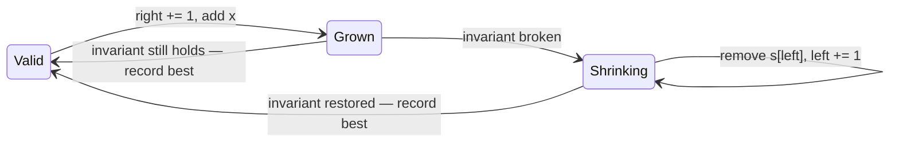

# Sliding window

You're reading a scroll through a cardboard frame. To see new text you slide
the right edge forward; when the frame shows something you don't want, you
slide the left edge forward until it's gone. You never rewind. That's the
sliding window: a contiguous slice `[left, right]` of an array or string that
only ever moves forward, maintaining some property as it goes.

The payoff: problems that look like "check all O(n²) subarrays" collapse to
O(n), because each element enters the window once and leaves at most once.

## The unified template

Nearly every window problem is this shape:

```python
def window(s):
    state = ...            # counts, sum — whatever describes the window
    left = 0
    best = 0
    for right, x in enumerate(s):
        add(state, x)                    # 1. expand: window is now [left, right]
        while broken(state):             # 2. shrink until the invariant holds
            remove(state, s[left])
            left += 1
        best = max(best, right - left + 1)   # 3. window is valid — record
    return best
```

The **invariant** is the sentence "the window always satisfies P" — at most K
distinct characters, sum < target, no repeated character. Step 2 restores it
after each expansion; step 3 only runs when it holds. Pick the invariant
first, and the code writes itself.

[Longest Substring Without Repeating
Characters](/problems/0003-longest-substring-without-repeating-characters),
concretely:

```python
def longest_unique(s):
    count = defaultdict(int)
    left = best = 0
    for right, c in enumerate(s):
        count[c] += 1
        while count[c] > 1:          # invariant broken: c repeated
            count[s[left]] -= 1
            left += 1
        best = max(best, right - left + 1)
    return best
```

O(n): `right` moves n times, `left` moves at most n times total — that inner
`while` is not a nested loop, and saying so out loud is your one-sentence
complexity justification.



## Fixed vs variable windows

| Kind | Window size | Shrink rule | Example |
|---|---|---|---|
| Fixed | exactly k | one `if right >= k` removal per step | [Permutation in String](/problems/0567-permutation-in-string), [Sliding Window Maximum](/problems/0239-sliding-window-maximum) |
| Variable, maximize | as long as valid | `while` broken | 0003, [Fruit Into Baskets](/problems/0904-fruit-into-baskets) |
| Variable, minimize | as short as valid | `while` **valid**, record inside | [Min Size Subarray Sum](/problems/0209-minimum-size-subarray-sum), [Min Window Substring](/problems/0076-minimum-window-substring) |

The minimize flavor flips the template: you shrink *while the window is
valid*, recording the length before each shrink, because you want the smallest
window that still works:

```python
def min_subarray_len(target, nums):
    left, total, best = 0, 0, float('inf')
    for right, x in enumerate(nums):
        total += x
        while total >= target:               # valid — try to make it smaller
            best = min(best, right - left + 1)
            total -= nums[left]
            left += 1
    return 0 if best == float('inf') else best
```

## The "at most K" trick, and exactly-K

"Longest window with **at most** K distinct" fits the template directly — the
invariant `distinct ≤ K` is easy to restore by shrinking. But "**exactly** K"
does not: shrinking can jump from K+1 distinct straight past K down to K−1,
so there's no clean invariant to hold.

The senior move: **exactly K = atMost(K) − atMost(K−1)**. Count subarrays
with at most K distinct, subtract those with at most K−1; what's left is
exactly K. [Subarrays with K Different
Integers](/problems/0992-subarrays-with-k-different-integers):

```python
def subarrays_with_k_distinct(nums, k):
    def at_most(k):
        count = defaultdict(int)
        left = res = 0
        for right, x in enumerate(nums):
            count[x] += 1
            while len(count) > k:
                count[nums[left]] -= 1
                if count[nums[left]] == 0:
                    del count[nums[left]]
                left += 1
            res += right - left + 1   # every window ending at right, ≥ left
        return res
    return at_most(k) - at_most(k - 1)
```

Note the counting line: when `[left, right]` is valid, so are all
`right - left + 1` subarrays ending at `right` — that's how a window *counts*
subarrays instead of measuring lengths.

## The never-shrink window

[Longest Repeating Character
Replacement](/problems/0424-longest-repeating-character-replacement): longest
window where (window length − count of most frequent char) ≤ k. The twist:
since you only want the *maximum* window ever seen, the window never needs to
get smaller — when it breaks, slide both ends forward by one and keep the
width. A shorter window can never improve the answer, so re-validating
smaller widths is wasted work:

```python
def character_replacement(s, k):
    count = defaultdict(int)
    left = best_freq = 0
    for right, c in enumerate(s):
        count[c] += 1
        best_freq = max(best_freq, count[c])
        if (right - left + 1) - best_freq > k:   # if, not while
            count[s[left]] -= 1
            left += 1
    return len(s) - left        # final width = max valid width ever
```

Two subtleties worth narrating: `best_freq` is allowed to go stale (it only
ever needs to be a *historical* max, since only a new max can grow the
answer), and the `if` never runs twice because the window grows by one per
step.

## When windows DON'T work

The shrink step assumes **monotonicity**: removing an element must move the
window toward validity. With all-positive numbers, removing from the left
always decreases the sum — good. With **negatives**, removing an element can
*increase* the sum, so "shrink while sum ≥ target" is no longer justified and
the window silently returns wrong answers. The fix is [prefix
sums](/study/02-patterns/24-prefix-sums) with a hash map. Interviewers plant
this trap deliberately: before saying "sliding window", check the constraint
line for `-10^4 <= nums[i]`.

Same failure class: "at most K" invariants work because adding can only break
them and removing can only fix them. If your property can flip both ways as
elements leave, the window can't maintain it.

## What the interviewer asks next

"Now the array has negatives" (prefix sums). "Now count the subarrays instead
of finding the longest" (the `right - left + 1` accumulation). "Exactly K
instead of at most K" (the subtraction trick). "Stream instead of array?"
(fixed windows survive; variable windows need the whole left history —
discuss memory). For 0239 specifically: "better than a heap?" — monotonic
deque, each element pushed and popped once, O(n).

## Practice ladder

1. [Longest Substring Without Repeating Characters](/problems/0003-longest-substring-without-repeating-characters)
   — the template in its purest maximize form.
2. [Minimum Size Subarray Sum](/problems/0209-minimum-size-subarray-sum) —
   the minimize flip; then articulate why negatives would break it.
3. [Permutation in String](/problems/0567-permutation-in-string) — fixed
   window with count-matching; learn the O(1) match check.
4. [Minimum Window Substring](/problems/0076-minimum-window-substring) — the
   boss fight of minimize windows: need/have bookkeeping under pressure.
5. [Sliding Window Maximum](/problems/0239-sliding-window-maximum) — fixed
   window + monotonic deque; a different data structure, same movement.
6. [Subarrays with K Different Integers](/problems/0992-subarrays-with-k-different-integers)
   — exactly-K via atMost subtraction; the pattern's final exam.
