# Sorting and the interval toolkit

A messy calendar week — meetings scribbled in random order — is unreadable.
The moment you list them by start time, structure appears: overlaps jump out,
gaps jump out, and questions like "how many rooms do I need?" become
answerable in one pass. That's the deal sorting offers: **pay O(n log n) once,
and a whole family of O(n) scans becomes available.** Interval problems are
where that deal pays off most visibly.

## What you must actually know about sorting

You will almost never implement a sort at Google — you'll be judged on
whether you know what the library one gives you.

- **Python's `sorted` is Timsort**: O(n log n) worst case, O(n) on
  already-sorted or mostly-sorted data (it detects and merges existing runs),
  O(n) extra space. Say "Timsort exploits existing runs" and you've said
  something true and specific.
- **Stability**: equal elements keep their original relative order. Timsort
  is stable; this is why you can sort by a secondary key first, then by a
  primary key, and get a full multi-key sort. It's also why
  `sorted(words, key=len)` keeps ties alphabetical *if they were already
  alphabetical* — order in, order out.
- **Custom keys**: `key=lambda iv: iv[0]` for sort-by-start,
  `key=lambda iv: (iv[0], -iv[1])` for "starts ascending, longer first".
  Prefer key functions over comparators; when you truly need a comparator
  (mixed-direction rules on strings, like
  [Reorder Log Files](/problems/0937-reorder-data-in-log-files)),
  `functools.cmp_to_key` exists.
- **Comparison sorts can't beat O(n log n)** — a comparison yields one bit,
  and distinguishing n! orderings needs log(n!) ≈ n log n bits. But when keys
  are small integers, **counting sort / bucket sort** are O(n + k):
  [Sort Colors](/problems/0075-sort-colors) with three counters,
  [Top K Frequent](/problems/0347-top-k-frequent-elements) with frequency
  buckets. The senior line: "comparison sorting is n log n, but these keys
  are bounded, so I can bucket."

## The interval toolkit

An interval is `[start, end]`. Almost every interval problem is solved by one
of three moves, and picking the right one is the whole game.

### Sort by START → merging and coverage

When the question is about the **union** — merge overlaps, find gaps, insert
a new interval — sort by start. Then the invariant is: *once I've scanned
past interval i, everything that could touch the current merged block has
been seen*, because later intervals start even later.

[Merge Intervals](/problems/0056-merge-intervals):

```python
def merge(intervals):
    intervals.sort(key=lambda iv: iv[0])
    out = [intervals[0][:]]
    for s, e in intervals[1:]:
        if s <= out[-1][1]:                 # overlaps (or touches) the block
            out[-1][1] = max(out[-1][1], e) # NOT just e — see traps
        else:
            out.append([s, e])
    return out
```

[Insert Interval](/problems/0057-insert-interval) is the same idea without
re-sorting: emit intervals ending before the new one, absorb everything that
overlaps it into one block, emit the rest.

### Sort by END → greedy selection

When the question is "how many non-overlapping intervals can I **keep**" (or
its mirror, "how few must I remove" —
[Non-overlapping Intervals](/problems/0435-non-overlapping-intervals)), sort
by **end**. Greedy: always keep the interval that ends earliest among those
that fit.

The WHY is an exchange argument, and you should be able to say it: suppose an
optimal solution keeps some interval A where greedy kept B, with B ending no
later than A (greedy picked the earliest end). Swap A for B — B ends earlier,
so everything after A still fits after B. The swap never hurts, so greedy's
choice is never wrong. **Finishing earliest leaves the most room for the
future** — that's the whole theorem in one sentence.

Sort-by-start greedy fails here: a meeting that starts first but lasts all
day would greedily block everything. Ending early, not starting early, is
what preserves options.

### Sweep line → counting concurrent intervals

When the question is "how many intervals overlap **at once**"
([Meeting Rooms II](/problems/0253-meeting-rooms-ii)), stop thinking in
intervals and think in **events**: a start is +1, an end is −1. Sort the
events, sweep left to right, track the running count; its maximum is the
answer.

```python
def min_meeting_rooms(intervals):
    events = []
    for s, e in intervals:
        events.append((s, 1))
        events.append((e, -1))
    events.sort()               # ties: (t,-1) < (t,1) — end frees room first
    rooms = best = 0
    for _, delta in events:
        rooms += delta
        best = max(best, rooms)
    return best
```



```mermaid
gantt
    dateFormat X
    axisFormat %s
    section Room 1
    A (0-30)   :a, 0, 30
    section Room 2
    B (5-10)   :b, 5, 10
    C (15-20)  :c, 15, 20
    section Sweep count
    "+1 +1 = 2 rooms" :milestone, 5, 0
```

Two meetings overlap at t=5, none of B/C overlap each other — two rooms.
The sweep sees +1(0) +1(5) −1(10) +1(15) −1(20) −1(30); the running count
peaks at 2. The equivalent two-sorted-arrays or min-heap-of-end-times
formulations are the same sweep in disguise — know one cold, mention the
others.

### Touching endpoints: pick a convention and state it

Does `[1,3]` overlap `[3,5]`? **It depends on the problem, and you must ask
or state your assumption** — this is a classic requirements-clarification
moment at Google:

- Merging usually treats touching as mergeable: `s <= out[-1][1]`.
- Scheduling usually treats touching as compatible (a meeting ending at 3 and
  one starting at 3 share a room): sort events so `(t, -1)` precedes
  `(t, +1)` — which tuple sort does automatically since −1 < 1.
- Strict-overlap versions flip both comparisons.

One character (`<` vs `<=`) encodes the decision; saying "I'll treat closed
endpoints as touching, per the examples" earns the point.

## Traps

- **`out[-1][1] = e` instead of `max(...)`** — interval `[1,10]` followed by
  `[2,3]` must keep end 10. Nesting, not just overlap.
- **Sorting by the wrong axis** — start for union questions, end for
  keep-the-most greedy. If you can't say why, derive it from the exchange
  argument on the spot.
- **Event tie-breaks** — ends before starts (or the reverse) silently changes
  answers at touching endpoints.
- **Claiming quicksort behavior for Python** — it's Timsort; `list.sort` is
  in-place, `sorted` copies.

## What the interviewer asks next

"Why sort by end and not start?" (exchange argument, verbatim). "What's the
complexity?" ("O(n log n) for the sort, then a linear sweep — sorting
dominates.") "What if intervals arrive as a stream?" (can't sort — keep a
sorted structure / heap of ends, discuss per-insert cost). "Weighted
intervals — maximize total weight kept?" (greedy breaks, exchange argument no
longer holds → DP with bisect,
[Maximum Profit in Job Scheduling](/problems/1235-maximum-profit-in-job-scheduling)).

## Practice ladder

1. [Merge Intervals](/problems/0056-merge-intervals) — sort-by-start union
   scan; the `max(end)` trap lives here.
2. [Insert Interval](/problems/0057-insert-interval) — three-phase emission,
   no re-sort; trains endpoint comparisons.
3. [Non-overlapping Intervals](/problems/0435-non-overlapping-intervals) —
   sort-by-end greedy; rehearse the exchange argument out loud.
4. [Meeting Rooms II](/problems/0253-meeting-rooms-ii) — the sweep line, plus
   the heap formulation as a follow-up.
5. [Employee Free Time](/problems/0759-employee-free-time) — merge across k
   sorted lists, then read the gaps; the toolkit under combination.
6. [Maximum Profit in Job Scheduling](/problems/1235-maximum-profit-in-job-scheduling)
   — where greedy dies and sorted-by-end + DP + bisect takes over.
