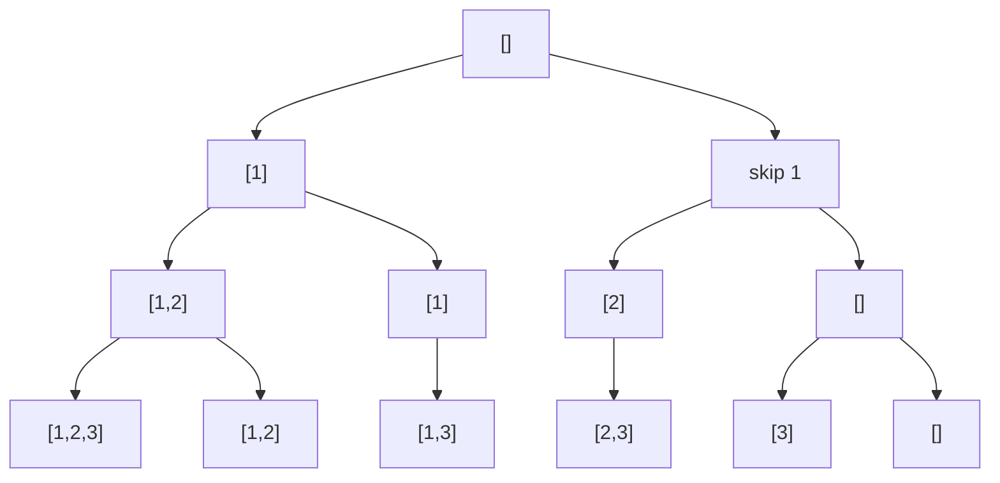

# Backtracking

Solving a maze with a ball of string: at each fork, pick a corridor, unroll
string behind you. Dead end? Follow the string back to the fork and try the
next corridor. You never teleport, you never forget which corridors you've
tried, and the string guarantees you can always undo your way home. That's
backtracking: **systematically explore every choice, undoing each one after
exploring it**, so the state you carry is always consistent with the path
you're on.

It's just DFS over a **decision tree** — a tree that exists only in your
head, where each node is a partial solution and each edge is one choice.

## The one template

```python
def backtrack(path, choices):
    if is_complete(path):
        results.append(path[:])      # copy! path keeps mutating
        return
    for c in candidates(choices, path):
        path.append(c)               # 1. choose
        backtrack(path, updated)     # 2. explore
        path.pop()                   # 3. unchoose — restore state exactly
    # invariant: path is identical before and after this call
```

Choose → explore → unchoose. The unchoose step is the ball of string: every
mutation made on the way down is reversed on the way up, so sibling branches
start from identical state. The two evergreen bugs are both violations of
this: appending `path` instead of `path[:]` (every result aliases one list
that ends up empty), and forgetting an undo (state leaks across branches —
same bug as the missing decrement in
[Path Sum III](/problems/0437-path-sum-iii)).

## The decision tree, drawn once

Subsets of `[1,2,3]`: at each element, the choice is *include it or not*.



Every backtracking problem is "what does one level of this tree look like?"
Answer that, and the code is the template with blanks filled.

## The three canonical shapes

**Subsets** — at index `i`, branch on include/exclude (or equivalently: loop
over "next element to add", starting from `i`):

```python
def subsets(nums):
    res, path = [], []
    def bt(start):
        res.append(path[:])          # every node is an answer
        for i in range(start, len(nums)):
            path.append(nums[i])
            bt(i + 1)                # strictly forward — no reordering
            path.pop()
    bt(0)
    return res
```

**Permutations** — every level chooses any unused element; track `used`:

```python
def permute(nums):
    res, path, used = [], [], [False] * len(nums)
    def bt():
        if len(path) == len(nums):
            res.append(path[:]); return
        for i in range(len(nums)):
            if used[i]: continue
            used[i] = True; path.append(nums[i])
            bt()
            path.pop(); used[i] = False   # both undos, always paired
    bt()
    return res
```

**Combination sum** — subsets shape plus a running total; reuse allowed means
recursing with `i`, not `i + 1`:

```python
def combination_sum(cands, target):
    cands.sort()                             # enables the break below
    res, path = [], []
    def bt(start, remain):
        if remain == 0:
            res.append(path[:]); return
        for i in range(start, len(cands)):
            if cands[i] > remain:
                break                        # sorted → all later ones too big
            path.append(cands[i])
            bt(i, remain - cands[i])         # i, not i+1: reuse allowed
            path.pop()
    bt(0, target)
    return res
```

The `start` index is what prevents duplicate combinations (`[2,3]` and
`[3,2]`): combinations move strictly forward, permutations don't. If a
problem has duplicate *values* and wants unique outputs, sort and add
`if i > start and cands[i] == cands[i-1]: continue` — skip a value the
*same level* already tried.

## Pruning: the difference between 2ⁿ and "finishes instantly"

Backtracking's worst case is brutal — but the whole craft is cutting branches
before exploring them:

1. **Sort first, break early** — the `break` in combination sum kills the
   entire rest of the level, not just one branch.
2. **Feasibility checks** — if remaining budget can't possibly reach the
   goal, return now.
3. **Constraint propagation** — N-Queens doesn't place a queen and *then*
   check; it tracks attacked columns/diagonals in sets so illegal squares are
   never tried. The rule: check constraints at the **choose** step, not the
   **complete** step.

## Complexity honesty

Don't mumble here — the honest numbers are a senior signal:

| Shape | Count | With output copying |
|---|---|---|
| subsets | 2ⁿ | O(n · 2ⁿ) |
| permutations | n! | O(n · n!) |
| combination sum | exponential in target/min(cand) | say "exponential, pruned" |

And read the constraints backwards: **n ≤ 20-ish screams that exponential is
intended.** If n were 10⁵, backtracking is the wrong tree entirely — that's
the [budget math](/study/00-foundations/01-big-o) doing pattern selection
for you.

## Grid backtracking: Word Search

The same template walks a 2-D grid. [Word Search](/problems/0079-word-search) (do
it on LeetCode) marks the current cell visited, tries four neighbors, and
unmarks on the way out:

```python
def exist(board, word):
    R, C = len(board), len(board[0])
    def bt(r, c, i):
        if i == len(word): return True
        if not (0 <= r < R and 0 <= c < C) or board[r][c] != word[i]:
            return False
        board[r][c], saved = '#', board[r][c]        # choose: mark visited
        found = any(bt(r+dr, c+dc, i+1)
                    for dr, dc in ((1,0),(-1,0),(0,1),(0,-1)))
        board[r][c] = saved                          # unchoose: restore
        return found
    return any(bt(r, c, 0) for r in range(R) for c in range(C))
```

In-place marking (`'#'`) instead of a visited set is the O(1)-space trick —
mention the trade (mutating input) out loud. Contrast with
[Word Break](/problems/0139-word-break): naive backtracking over split points
is exponential, but the subproblem "can s[i:] be segmented?" repeats — add
memoization and it collapses to polynomial. **Backtracking + repeated
subproblems = you've discovered DP.** That bridge sentence is worth saying in
interviews.

## N-Queens framing

N-Queens is backtracking's showcase: one queen per row (the levels), choices
are columns, and pruning sets — `cols`, `diag (r−c)`, `anti (r+c)` — make
each placement O(1) to validate. Nothing new beyond the template; the lesson
is *representing constraints so pruning is cheap*.

## What the interviewer asks next

"Can you avoid recursion?" (explicit stack of (state, next-choice) — rarely
worth it, know it's possible). "How many solutions will this generate?" (the
honesty table). "Duplicates in the input?" (sort + same-level skip). "This
is slow — can you memoize?" (only if state repeats *and* is hashable-small;
subsets/permutations don't repeat state, Word Break does).

## Practice ladder

The bank is thin on pure backtracking, so this ladder mixes bank problems
with LeetCode drills to do directly:

1. [Subsets](/problems/0078-subsets) and LC 46 (Permutations, external) — code both
   from memory until choose/explore/unchoose is muscle.
2. [Combination Sum](/problems/0039-combination-sum) — the start-index +
   sort-and-break combo. Then [Generate Parentheses](/problems/0022-generate-parentheses)
   for the invariant-pruned variant.
3. [Word Break](/problems/0139-word-break) — start it as backtracking, feel
   the TLE coming, add memoization; the DP bridge in one sitting.
4. [Word Search](/problems/0079-word-search) — grid backtracking with
   in-place marking (the hidden suite punishes a missing un-mark).
5. [Path Sum III](/problems/0437-path-sum-iii) — the choose/unchoose
   discipline applied to a running hashmap on a tree.
6. [N-Queens](/problems/0051-n-queens) — the capstone: constraint sets, pruning, and clean
   output construction under pressure.
