# Seeing the graph

Nobody hands you a graph in an interview. Nobody says "here is a graph, run
BFS." They hand you a grid of oranges, a list of course prerequisites, a
dictionary of words — and the whole trick is *recognizing* that underneath
there are **things** and **connections between things**. Things are nodes.
Connections are edges. The moment you say "I'll model this as a graph," half
the problem is solved, because graphs come with a tiny, well-worn toolbox:
BFS, DFS, and a visited set. Most graph interview problems are one of those
three plus bookkeeping.

## Where graphs hide

| You're given… | Nodes are… | Edges are… | Example |
|---|---|---|---|
| A 2-D grid | cells | 4-directional neighbors | [Number of Islands](/problems/0200-number-of-islands) |
| Prerequisite pairs | courses/tasks | "must come before" | [Course Schedule](/problems/0207-course-schedule) |
| A word list | words | differ by one letter | [Word Ladder](/problems/0127-word-ladder) |
| A puzzle/state | full game states | one legal move | lock combinations, sliding puzzles |

That last row is the deep one: **any "state + moves" problem is a graph**,
even when nothing looks graph-like. A combination lock's node is the 4-digit
state, and each turn of a wheel is an edge. If someone asks "minimum number
of moves to reach X," your reflex should be: nodes = states, edges = moves,
run BFS.

## Three ways to store a graph

An **adjacency list** is a phone contact list: for each person, the people
they know. An **adjacency matrix** is a giant grid with a checkmark for every
pair that knows each other. An **implicit graph** stores nothing — you compute
neighbors on demand ("from grid cell (r, c), the neighbors are up/down/
left/right").

| Representation | Space | "Is u→v an edge?" | "All neighbors of u" | Use when |
|---|---|---|---|---|
| Adjacency list | O(V + E) | O(deg(u)) | O(deg(u)) | almost always — sparse graphs |
| Adjacency matrix | O(V²) | O(1) | O(V) | dense graphs, tiny V |
| Implicit | O(1) | compute it | compute it | grids, word ladders, state spaces |

In Python the adjacency list is one line:

```python
from collections import defaultdict

graph = defaultdict(list)
for u, v in edges:
    graph[u].append(v)
    graph[v].append(u)   # drop this line for a directed graph
```

`defaultdict(list)` means a node with no edges just returns `[]` — no
key-existence dance. For grids, don't build anything; compute neighbors:

```python
for dr, dc in ((1, 0), (-1, 0), (0, 1), (0, -1)):
    nr, nc = r + dr, c + dc
    if 0 <= nr < rows and 0 <= nc < cols:
        ...
```

## BFS vs DFS: the decision in three questions

Both visit every reachable node exactly once — O(V + E). The difference is
*order*. BFS explores in rings (everything 1 step away, then 2, then 3…);
DFS dives down one path until it dead-ends, then backtracks.

1. **"Shortest / fewest / minimum steps" in an unweighted graph?** → **BFS.**
   Because BFS visits nodes in increasing distance order, the first time you
   reach the target *is* the shortest path. DFS gives you *a* path, not the
   shortest.
2. **"Explore everything / count regions / does a path exist / exhaust all
   possibilities"?** → **DFS** (or BFS — either works, DFS is less code).
3. **Could the recursion go 10⁵ deep?** → write it **iteratively** (BFS with
   a `deque`, or DFS with an explicit stack). Python's default recursion
   limit is 1000, and a 1000×1000 grid of all land will blow it. Saying
   "I'll do iterative DFS because the recursion could be a million deep" is
   a senior-level sentence.

## The visited set, and the classic bug

A visited set exists to guarantee each node is processed once. In BFS there
is exactly one correct place to mark it: **when you enqueue, not when you
dequeue.**

```python
from collections import deque

def bfs(graph, start):
    visited = {start}                  # mark BEFORE the loop
    queue = deque([start])
    while queue:
        node = queue.popleft()
        for nbr in graph[node]:
            if nbr not in visited:
                visited.add(nbr)       # mark on ENQUEUE  <- the whole game
                queue.append(nbr)
```

Why? If you mark on dequeue, a node can be *enqueued many times* before its
first copy comes out of the queue:

```mermaid
graph TD
    A --> B
    A --> C
    B --> D
    C --> D
    D:::dup
    classDef dup fill:#3d2022,stroke:#f4595e
```



A enqueues B and C. B's turn: enqueues D. C's turn: D is *still not marked*
(it's sitting in the queue, unprocessed), so C enqueues D **again**. In a
dense graph every node gets enqueued once per in-edge — the queue balloons
to O(E) duplicates and your "O(V + E)" BFS quietly becomes O(V·E). Correct
answers still come out, which is exactly why this bug survives to the
follow-up question "what's your complexity?" — and then it kills you.
Mark-on-enqueue means each node enters the queue at most once, full stop.

For DFS the same discipline applies with a stack; with recursion, mark at
the top of the call.

## Flood fill: DFS on a grid

"Count the islands" = count connected components of land cells. Scan every
cell; when you find unvisited land, that's one new island — flood it so you
never count it again:

```python
def numIslands(grid):
    rows, cols = len(grid), len(grid[0])

    def sink(r, c):
        if not (0 <= r < rows and 0 <= c < cols) or grid[r][c] != "1":
            return
        grid[r][c] = "0"               # mutate the grid AS the visited set
        sink(r+1, c); sink(r-1, c); sink(r, c+1); sink(r, c-1)

    count = 0
    for r in range(rows):
        for c in range(cols):
            if grid[r][c] == "1":
                count += 1
                sink(r, c)
    return count
```

O(rows·cols) time — every cell is visited a constant number of times — and
mutating the grid gives O(1) extra space (mention the recursion stack, and
offer the iterative version if the interviewer minds mutation or depth).
[Surrounded Regions](/problems/0130-surrounded-regions) is the same skill
with a twist: flood from the *border* first to find what survives.

## Multi-source BFS: many starts, one queue

[Rotting Oranges](/problems/0994-rotting-oranges) asks "how many minutes
until everything rots, spreading from *all* rotten oranges at once?" The
elegant move: seed the queue with **every** rotten orange at distance 0,
then run one ordinary BFS. Conceptually you've added a virtual super-source
connected to all sources — the BFS rings then mean "distance to the *nearest*
source," and the answer is the largest ring number. Same code, different
seeding. This one idea also solves "distance to nearest gate/exit/wall"
problems in one pass instead of one BFS per source.

## Traps

- Marking visited on dequeue (see above). The #1 graph bug in interviews.
- Forgetting the graph may be **disconnected** — loop over all nodes as
  starting points, not just node 0.
- Recursive DFS on big inputs → `RecursionError`. Know the iterative form
  cold.
- Directed vs undirected: adding both `u→v` and `v→u` when the problem said
  directed (or forgetting the reverse edge when it said undirected).
- On grids, mutating the input as your visited set is fine — but *say* you're
  doing it and offer a `visited` set if mutation is unwelcome.

## What the interviewer asks next

"What if the grid is huge and mostly empty?" (implicit graph + only store
visited). "What if edges had weights?" (BFS no longer gives shortest paths —
that's Dijkstra, next-next chapter). "Can you do it without recursion?"
(iterative DFS, have it ready). "What's the space complexity of your BFS?"
(O(V) for queue + visited; on a grid the frontier can hold O(min(rows, cols)·
something) — just say O(rows·cols) worst case).

## Practice ladder

1. [Number of Islands](/problems/0200-number-of-islands) — the canonical
   flood fill; get the DFS template into muscle memory.
2. [Rotting Oranges](/problems/0994-rotting-oranges) — multi-source BFS with
   level counting; trains the "seed everything at once" move.
3. [Surrounded Regions](/problems/0130-surrounded-regions) — inverse
   thinking: flood from the border to find survivors.
4. [Clone Graph](/problems/0133-clone-graph) — traversal plus a
   node→copy map; trains visited-set discipline on a non-grid graph.
5. [Word Ladder](/problems/0127-word-ladder) — an implicit graph you must
   *see*; BFS because "shortest transformation."
