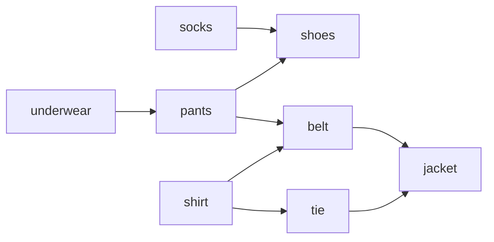

# Topological sort

Getting dressed in the morning: socks before shoes, shirt before jacket. Some
things must come before others; plenty of pairs don't care (socks vs shirt —
any order). A **topological sort** is any full ordering that respects every
"before" constraint. It only exists for **directed acyclic graphs** (DAGs) —
if shoes require socks and socks somehow require shoes, no valid morning
exists. That's the whole punchline: *a topological order exists if and only
if the graph has no cycle*, so every topo-sort algorithm is secretly also a
cycle detector, and interviewers use it that way constantly.



Valid orders for this DAG: many. Invalid: any that puts shoes before socks.

## Kahn's algorithm: peel from the front

Intuition: something with **no prerequisites** can safely go first. Do it,
cross it off — which may free up things that were only waiting on it — and
repeat. "Number of unmet prerequisites" is the node's **indegree** (count of
incoming edges).

```python
from collections import defaultdict, deque

def topo_order(n, edges):            # edges: (before, after) pairs
    graph = defaultdict(list)
    indegree = [0] * n
    for u, v in edges:               # u must come before v
        graph[u].append(v)
        indegree[v] += 1

    queue = deque(i for i in range(n) if indegree[i] == 0)
    order = []
    while queue:
        node = queue.popleft()
        order.append(node)
        for nbr in graph[node]:
            indegree[nbr] -= 1       # this prerequisite is now met
            if indegree[nbr] == 0:
                queue.append(nbr)

    return order if len(order) == n else []   # short order ⇒ cycle
```

O(V + E): every node enters the queue once and every edge is decremented
once. The cycle detection falls out for free — and here's the why. Nodes on
a cycle each have an in-edge *from within the cycle*, so none of them can
ever drop to indegree 0: each waits on the previous one, forever. They never
enter the queue, so `len(order) < n`. That one sentence — "a cycle can never
drain to indegree zero, so leftovers mean a cycle" — is the spoken proof the
interviewer wants.

Read a prerequisite pair carefully before building edges.
[Course Schedule](/problems/0207-course-schedule) gives `[a, b]` meaning "b
before a" — the edge is b→a. Getting the arrow backwards is the most common
mistake in this whole topic.

## DFS post-order, reversed

The second classic: run DFS; when a node *finishes* (all descendants fully
explored), append it. A node finishes only after everything it points to has
finished — so the finish list is "dependents first," and **reversing it**
gives a topological order.

Cycle detection here needs **three colors**, and it's worth understanding
rather than memorizing. WHITE = untouched. GRAY = currently on the recursion
stack (we entered it, haven't finished). BLACK = completely done. The key
claim: **an edge into a GRAY node is a cycle, and an edge into a BLACK node
never is.** Why? A GRAY node is your own ancestor in the current DFS path —
an edge back to your ancestor closes a loop. A BLACK node is fully explored
and provably reaches no GRAY node (or we'd have found that cycle already), so
walking into it can't loop back to you. A plain visited set can't make this
distinction — it would flag harmless "cross" edges into finished nodes as
cycles, or miss real ones.

```python
def topo_dfs(n, edges):
    graph = defaultdict(list)
    for u, v in edges:
        graph[u].append(v)

    WHITE, GRAY, BLACK = 0, 1, 2
    color = [WHITE] * n
    out = []

    def dfs(node):                    # returns False on cycle
        color[node] = GRAY
        for nbr in graph[node]:
            if color[nbr] == GRAY:    # back-edge to an ancestor ⇒ cycle
                return False
            if color[nbr] == WHITE and not dfs(nbr):
                return False
        color[node] = BLACK
        out.append(node)              # post-order: append on FINISH
        return True

    for i in range(n):
        if color[i] == WHITE and not dfs(i):
            return []
    return out[::-1]                  # reverse of finish order
```

Also O(V + E). In an interview, code Kahn's — it's iterative (no recursion
limit worries), and the indegree bookkeeping reads clearly. Know the DFS
version well enough to explain three colors, because "how else could you do
it?" is the standard follow-up.

## Layers: the parallel-scheduling framing

Kahn's has a hidden bonus. Instead of popping one node at a time, process the
queue **level by level**: everything currently at indegree 0 is a batch of
tasks with no unmet dependencies — they can all run *in parallel*. The number
of rounds is the longest chain in the DAG, and it's the minimum possible
completion time with unlimited workers. If an interviewer upgrades "order the
courses" to "how many semesters, taking any number of courses per semester?"
— that's just Kahn's with a `for _ in range(len(queue))` level loop, exactly
like level-order traversal on a tree.

## Alien dictionary, in sketch

Given a sorted list of words in an unknown alphabet, recover the letter
order. For each adjacent word pair, find the **first differing character** —
that single comparison yields one edge (`'w' before 'e'` etc.); characters
past the first difference tell you nothing. Build the graph from all adjacent
pairs, topo-sort the letters, and handle two edge cases: a cycle means the
input is inconsistent (no valid alphabet), and the prefix trap — `["abc",
"ab"]` is invalid immediately, since a longer word can't sort before its own
prefix. It's a famous Google-flavored problem precisely because the graph
*modeling* is the test; the sort itself is the template above.

## Traps

- Edge direction flipped from the problem's pair convention (0207's `[a, b]`
  = edge b→a).
- Forgetting that returning fewer than n nodes *is* the cycle signal in
  Kahn's — no separate detector needed.
- Using a two-state visited set in the DFS version and mis-detecting cycles;
  it's three colors or nothing.
- Claiming "the" topological order — usually many exist. If they ask for
  a *unique* order, that requires the queue to hold exactly one node at every
  step of Kahn's.
- Duplicate edges inflating indegree — dedupe if the input can repeat pairs.

## What the interviewer asks next

"Detect the cycle *and return it*?" — with DFS, keep the GRAY path on a
stack; when you hit a GRAY node, the stack from that node onward is the
cycle. "What if new prerequisite edges arrive online?" — incremental topo
sort exists but is genuinely hard; the honest answer is "re-run in O(V+E), or
discuss known incremental algorithms as out of interview scope." "Minimum
semesters with a per-semester course cap?" — layers plus greedy/matching;
reason it out loud.

## Practice ladder

1. [Course Schedule](/problems/0207-course-schedule) — can you finish? Pure
   cycle detection; run Kahn's and compare the count.
2. [Course Schedule II](/problems/0210-course-schedule-ii) — now return the
   order; same code, keep the list you were already building.
3. [Graph Valid Tree](/problems/0261-graph-valid-tree) — the undirected
   cousin of acyclicity: connected + exactly n−1 edges; sharpens your sense
   of what "cycle" means in each edge-direction world.
4. [Word Ladder](/problems/0127-word-ladder) — not a topo sort, but the same
   "extract a graph from strings" modeling muscle the alien dictionary needs.
