# Shortest paths

"Shortest path" means different tools depending on one question: **do the
edges have weights?** No weights (every hop costs 1) → BFS, done. Non-negative
weights → Dijkstra. Negative weights → Bellman-Ford, and by that point the
interview is really a conversation. Most interview problems live in the first
two rows, and the fastest way to lose time is reaching for Dijkstra when BFS
already solves it.

| Situation | Tool | Cost | One-line why |
|---|---|---|---|
| Unweighted (or all edges equal) | BFS | O(V + E) | rings = distance |
| Weights ∈ {0, 1} | 0-1 BFS (deque) | O(V + E) | free edges stay in the current ring |
| Non-negative weights | Dijkstra | O(E log V) | closest settled node can't improve |
| Negative weights, no neg. cycle | Bellman-Ford | O(V·E) | relax everything V−1 times |
| Huge graph, one known target | A* | Dijkstra + heuristic | explore toward the goal |

## BFS is a shortest-path algorithm

This deserves saying explicitly, because people file BFS under "traversal"
and forget its superpower. BFS visits nodes in rings: everything at distance
1, then distance 2, then 3. So **the first time BFS touches a node, it has
found the shortest path to it** — no node in ring k can have a shorter route
than k, because a shorter route would have put it in an earlier ring. That's
the entire proof, and it's why [Word Ladder](/problems/0127-word-ladder)
("fewest transformations") and [Shortest Path in Binary
Matrix](/problems/1091-shortest-path-in-binary-matrix) ("fewest cells,
8-directional") are BFS problems, no heap in sight. Track distance either by
storing `(node, dist)` pairs in the queue or by processing the queue level by
level and counting rings.

## Dijkstra, from first principles

Now edges have costs — flight prices, road lengths — and "fewest hops" stops
being "cheapest." A 3-hop route can be cheaper than a 1-hop route.

The idea, as an analogy: pour water on the start node and let it spread
along edges at a speed of one cost-unit per second. The wavefront reaches
every node exactly at its shortest distance. Dijkstra simulates that flood:
repeatedly **settle** the unsettled node the wave would reach next — the one
with the smallest tentative distance — and relax its outgoing edges.

**Why is greedy safe?** When you pop the closest unsettled node u at
tentative distance d, could some other route to u be shorter? Any such route
must leave the settled region through some other unsettled node w — but w's
tentative distance is ≥ d (u was the minimum), and with **non-negative
weights** the rest of the path from w can only add cost. So no detour beats
d, and u's distance is final. The moment one edge can be negative, "can only
add cost" fails, and the whole argument — and the algorithm — breaks. That
paragraph, out loud, is exactly the level of justification a senior loop
wants.

```mermaid
graph LR
    S["src · 0"] --> A["a · 2"]
    S --> B["b · 5"]
    A --> U["u · 4 ← pop next"]
    B --> W["w · 6"]
    W -. "≥ 6 + rest" .-> U
    A --> X["x · ?"]
    style S fill:#1f3d2e,stroke:#2ecc8f
    style A fill:#1f3d2e,stroke:#2ecc8f
    style B fill:#1f3d2e,stroke:#2ecc8f
    style U fill:#3d3420,stroke:#f5b942
    style W fill:#3d3420,stroke:#f5b942
    style X fill:#3d2022,stroke:#f4595e
```



Green = settled (distance final), amber = the frontier heap, red = untouched.
`u` at 4 is the frontier minimum, so any rival route through `w` starts at
≥ 6 and non-negative edges can only add — 4 is final. That picture *is* the
proof.

The idiomatic Python version uses **lazy deletion**: `heapq` can't decrease
a key that's already in the heap, so we push duplicates and discard stale
ones when popped.

```python
import heapq
from collections import defaultdict

def dijkstra(n, edges, src):          # edges: (u, v, w), directed
    graph = defaultdict(list)
    for u, v, w in edges:
        graph[u].append((v, w))

    dist = {src: 0}
    heap = [(0, src)]                 # (distance, node)
    while heap:
        d, u = heapq.heappop(heap)
        if d > dist.get(u, float("inf")):
            continue                  # stale entry — a better one was settled
        for v, w in graph[u]:
            nd = d + w
            if nd < dist.get(v, float("inf")):
                dist[v] = nd
                heapq.heappush(heap, (nd, v))   # push, never decrease-key
    return dist                        # nodes absent ⇒ unreachable
```

O(E log V) time — each edge can push one heap entry, each push/pop costs
log of the heap size — and O(V + E) space. The `if d > dist…: continue` line
is the lazy deletion; forgetting it keeps the answer correct but reprocesses
stale entries. Two structural echoes worth noticing: delete the `if`-skip
and the heap and you have BFS with a queue; and dijkstra-with-a-heap is the
graph version of "always expand the cheapest frontier" — the same shape as
best-first search everywhere.

If you need the path itself, not just costs: keep a `parent` dict, set
`parent[v] = u` whenever you improve `dist[v]`, and walk it backwards from
the target.

## 0-1 BFS: the deque trick

When every edge weighs 0 or 1, you don't need a heap. Use a deque: relaxing
a **0-edge** appends the neighbor to the **front** (same distance — it
belongs in the current ring), a **1-edge** to the **back** (next ring). The
deque stays sorted by distance, so you get Dijkstra's guarantee at BFS price,
O(V + E). Classic setting: a grid where moving is free but breaking a wall
costs 1.

## Bellman-Ford, as a name

When edges can be **negative**, know the name: Bellman-Ford relaxes *every*
edge, V−1 times over, costing O(V·E) — no greedy, no heap, just "any shortest
path has at most V−1 edges, and pass k locks in all paths of ≤ k edges." If
a V-th pass still improves something, a **negative cycle** is reachable and
"shortest" is undefined (loop forever, cost → −∞). Interviews rarely ask you
to code it; they ask whether you *know Dijkstra fails on negatives and what
you'd reach for instead*. This paragraph is the answer.

## A*, in one paragraph

A* is Dijkstra plus a compass: order the heap by `dist_so_far +
heuristic(node)`, where the heuristic is an optimistic estimate of remaining
cost to a known target (straight-line distance on a map, Manhattan distance
on a grid). If the heuristic never overestimates, A* still finds the true
shortest path while exploring far fewer nodes, because it stops flooding in
directions that can't win. Name it when the interviewer says "the graph is
enormous and you know where the target is."

## Traps

- Running Dijkstra on an unweighted graph — correct, but O(E log V) and
  extra code where BFS is O(V + E). Interviewers notice the mismatch.
- Running plain BFS on a *weighted* graph — first arrival is no longer
  cheapest. This one is wrong, not just slow.
- Omitting the stale-entry skip in lazy-deletion Dijkstra, then misquoting
  the complexity.
- Marking grid-BFS cells visited on dequeue instead of enqueue — the
  duplicate-blowup bug from the graph-thinking chapter, and 1091's grader
  will show it as TLE.
- Negative edge sneaks into the problem ("discount vouchers on some
  flights") and Dijkstra is silently wrong — always ask about weight signs.

## What the interviewer asks next

"Why exactly does Dijkstra need non-negative weights?" — give the settled-
region argument above. "K stops at most?" — state becomes (node,
stops-used); you're running shortest path on a layered graph. "All-pairs?" —
run Dijkstra from each node, or name Floyd-Warshall O(V³) for small dense
graphs. "Path, not just distance?" — parent pointers.

## Practice ladder

1. [Shortest Path in Binary Matrix](/problems/1091-shortest-path-in-binary-matrix)
   — pure grid BFS with 8 directions; drills mark-on-enqueue under time
   pressure.
2. [Rotting Oranges](/problems/0994-rotting-oranges) — multi-source BFS as
   "distance from nearest source"; the shortest-path view of a spreading
   process.
3. [Word Ladder](/problems/0127-word-ladder) — implicit graph + BFS; the
   neighbor-generation cost (26·L per word) is the real complexity question.
4. External drills for the heap: **LC 743 Network Delay Time** (textbook
   Dijkstra — the code above nearly verbatim) and **LC 787 Cheapest Flights
   Within K Stops** (the (node, stops) state twist, and a place where
   Bellman-Ford-style passes shine). Not in the bank; do them on LeetCode.
