# DP demystified — the framework

You already do dynamic programming. When someone asks "what's 47 × 12 plus 47 × 8?"
you don't compute 47 × 12 twice — you notice the shared work and reuse it. That's
the entire trick: **recursion that remembers**. DP feels scary because people
teach the table first and the reason last. We'll do it the other way around.

## The disease: the exploding call tree

Take the most honest recursive Fibonacci:

```python
def fib(n):
    if n <= 1:
        return n
    return fib(n - 1) + fib(n - 2)
```

Watch what `fib(5)` actually computes:

```mermaid
graph TD
    A[f5] --> B[f4] & C[f3]
    B --> D[f3] & E[f2]
    C --> F[f2] & G[f1]
    D --> H[f2] & I[f1]
    E --> J[f1] & K[f0]
    H --> L[f1] & M[f0]
    F --> N[f1] & O[f0]
    style D fill:#3d2022,stroke:#f4595e
    style C fill:#3d2022,stroke:#f4595e
    style E fill:#3d3420,stroke:#f5b942
    style F fill:#3d3420,stroke:#f5b942
    style H fill:#3d3420,stroke:#f5b942
```



`fib(3)` is computed twice (red), `fib(2)` three times (yellow). Every duplicate
spawns its own duplicate subtree, so the tree doubles roughly every level:
**O(2ⁿ)**. This is the diagnosis DP cures: **overlapping subproblems** — the
same question asked many times.

## The cure: remember the answer

Cache each answer the first time you compute it:

```python
def fib(n, memo={}):
    if n <= 1:
        return n
    if n not in memo:
        memo[n] = fib(n - 1, memo) + fib(n - 2, memo)
    return memo[n]
```

The tree collapses into a chain — each value computed once, looked up ever after:

```mermaid
graph LR
    A[f5] --> B[f4] --> C[f3] --> D[f2] --> E[f1] --> F[f0]
    style A fill:#1f3d2e,stroke:#2ecc8f
    style B fill:#1f3d2e,stroke:#2ecc8f
    style C fill:#1f3d2e,stroke:#2ecc8f
    style D fill:#1f3d2e,stroke:#2ecc8f
```



Six nodes instead of fifteen; for n = 50, fifty-one nodes instead of ~10¹⁰.
That collapse — exponential tree to linear chain — **is** dynamic programming.
Everything else is bookkeeping.

DP applies exactly when two things hold: **overlapping subproblems** (same
sub-question recurs) and **optimal substructure** (the best answer to the big
problem is built from best answers to smaller ones). If subproblems don't
overlap, plain divide-and-conquer (merge sort) is enough. If substructure
fails — say, "longest simple path in a graph", where a best sub-path can block
the rest — DP silently gives wrong answers, not slow ones. Check both.

## The 5 questions (answer these and the code writes itself)

Every DP problem, from fib to Google-hard, is fully specified by five answers:

1. **State** — what's the *smallest description* of a subproblem?
   ("best answer using the first i houses.") State is the hard creative step;
   the other four follow from it.
2. **Choices** — at each state, what decisions can you make? (rob house i, or
   skip it.)
3. **Recurrence** — how does each choice reduce the state to smaller states?
   (`f(i) = max(f(i-1), nums[i] + f(i-2))`.)
4. **Base cases** — which states are trivially known? (`f(0) = 0`.)
5. **Answer location** — which state holds the final answer? (Sometimes `f(n)`,
   sometimes `max` over all states — LIS bites people here.)

Say these five out loud in an interview *before* coding. It structures your
thinking and shows the interviewer a process, not a memorized solution.

## Deriving a recurrence out loud: the "last position" trick

Stuck on question 3? Stand at the **end** of an answer and ask: *what was the
last decision?* For [House Robber](/problems/0198-house-robber): any optimal
plan for houses 0..i either robs house i or doesn't. If it does, the rest is an
optimal plan for 0..i-2. If not, it's an optimal plan for 0..i-1. Two cases,
each a smaller version of the same question — that's the recurrence:

> "The best plan through house i either takes house i (so add its cash to the
> best through i−2) or skips it (best through i−1). Take the max."

This trick generalizes: last coin used, last character matched, last job
scheduled. Casing on the **last choice** always partitions the solution space
cleanly, because every solution has exactly one last choice.

## Top-down first (it's just the recurrence, typed)

```python
from functools import lru_cache

def rob(nums: list[int]) -> int:
    @lru_cache(maxsize=None)
    def best(i: int) -> int:          # state: best loot from houses 0..i
        if i < 0:
            return 0                  # base: no houses, no loot
        return max(best(i - 1),       # choice: skip house i
                   nums[i] + best(i - 2))  # choice: rob house i
    return best(len(nums) - 1)        # answer lives at the last state
```

One sentence for complexity: "n distinct states, O(1) work per state after
memoization, so O(n) time and O(n) space for the cache plus recursion stack."
That per-state accounting — states × work-per-state — is how you cost *every*
DP, so make it a reflex.

Top-down is where you should **start** in interviews: it's a direct
transcription of the recurrence, it only computes states that are reachable,
and it's hard to get the iteration order wrong (there isn't one). Its costs:
Python recursion overhead, and a stack that overflows near depth ~1000 unless
you raise the limit.

## The mechanical 4-step conversion to bottom-up

Interviewers often ask "can you do this iteratively?" Good news: the conversion
is **mechanical** — no new insight required. Four rewrites:

| Step | Top-down | Bottom-up |
|---|---|---|
| 1. State → indices | `best(i)` | `dp[i]` |
| 2. Memo → table | `@lru_cache` | `dp = [0] * (n + 1)` |
| 3. Recursion order → loop order | calls recurse toward base | loop **from** base toward answer |
| 4. Base case → initialization | `if i < 0: return 0` | fill `dp[0]`, `dp[1]` before looping |

Applied to the same problem, side by side with the recursive version above:

```python
def rob(nums: list[int]) -> int:
    n = len(nums)
    if n == 1:
        return nums[0]
    dp = [0] * n                      # step 2: memo becomes a table
    dp[0] = nums[0]                   # step 4: bases become initialization
    dp[1] = max(nums[0], nums[1])
    for i in range(2, n):             # step 3: loop from base toward answer
        dp[i] = max(dp[i - 1], nums[i] + dp[i - 2])   # same recurrence, verbatim
    return dp[-1]
```

The recurrence line is *identical* — only the plumbing changed. Step 3 hides
the one real rule: **by the time you compute a state, every state it reads must
already be filled.** For 1-D left-to-right that's automatic; in 2-D DP the loop
order is where bugs live, so always ask "which cells does `dp[i][j]` read, and
have I filled them yet?"

## Space optimization: rolling down to O(1)

`dp[i]` reads only `dp[i-1]` and `dp[i-2]` — so why store all n? Keep two
variables and roll them forward:

```python
def rob(nums: list[int]) -> int:
    prev2, prev1 = 0, 0               # best through i-2, best through i-1
    for x in nums:
        prev2, prev1 = prev1, max(prev1, x + prev2)
    return prev1
```

O(1) space. The general rule: if the recurrence reads only the previous k rows
of the table, store only k rows ("rolling rows" — in 2-D grid DP you keep one
row of length m instead of the whole n×m table). One warning for the follow-up:
if the interviewer then asks you to **reconstruct the actual choices** (which
houses were robbed), you need the full table back — space optimization trades
away the paper trail. Saying that unprompted is a senior signal.

## Traps

- **Wrong state.** If your recurrence needs information the state doesn't
  carry ("did I rob the previous house?" when the state is just `i` — fine
  here, fatal elsewhere), enlarge the state. Most "DP is giving wrong answers"
  bugs are under-specified states.
- **Mutable default `memo={}`** persists across calls in Python. Fine in a
  script, a landmine in a class. Use `lru_cache` or pass the dict explicitly.
- **Off-by-one between "first i items" and "index i".** Pick one convention
  (`dp[i]` = answer for the first i items, table size n+1) and narrate it.
- **Memoizing a function with side effects or float states** — cache keys must
  be hashable and the function pure.

## What the interviewer asks next

- "What's the time complexity?" → states × work per state, one sentence.
- "Iterative version?" → run the 4-step recipe.
- "Can you reduce space?" → rolling variables; mention the reconstruction cost.
- "What if the houses are in a circle?" → state design question: solve twice,
  excluding first or last house — shows you can adapt a recurrence, not just
  recite it.

## Practice ladder

1. [House Robber](/problems/0198-house-robber) — the 5 questions and the
   take/skip recurrence in their purest form; do top-down, bottom-up, and O(1)
   space, in that order.
2. [Coin Change](/problems/0322-coin-change) — same framework, but minimizing
   over many choices per state instead of two, plus an "unreachable" sentinel.
3. [Unique Paths](/problems/0062-unique-paths) — your first 2-D state; watch
   the fill order rule become visible.
