# 1-D DP patterns

Almost every one-dimensional DP you'll meet is one of five templates wearing a
costume. Learn the five, and "is this DP?" turns into "which of my five is
this?" The state is always some form of *"answer for the prefix ending at (or
of length) i"* — what changes is what you're doing at each state: choosing,
minimizing, counting, splitting, or extending.

| Family | State meaning | Recurrence shape | Flagship |
|---|---|---|---|
| Take / skip | best value using first i items | `max(skip, take + f(i-k))` | [House Robber](/problems/0198-house-robber) |
| Min-cost to reach | cheapest way to hit amount/position i | `1 + min(f(i - step))` over steps | [Coin Change](/problems/0322-coin-change) |
| Count ways | number of ways to build prefix i | `sum(f(i - step))` over valid steps | [Decode Ways](/problems/0091-decode-ways) |
| Partition / segment | can (or how well can) prefix i be split | `any/best over last-segment cuts` | [Word Break](/problems/0139-word-break) |
| Best ending here | best structure that **ends at** i | `1 + max over valid j < i` | [LIS](/problems/0300-longest-increasing-subsequence) |

Spot the signature, and the 5-question framework fills in the rest.

## Take / skip: House Robber and family

Covered in depth in [the framework chapter](/study/04-dp/40-dp-framework) —
the essence: each item is taken or skipped, and taking it disqualifies some
neighbors. `f(i) = max(f(i-1), nums[i] + f(i-2))`. Variants dress it up
(circular street, houses on a tree, "delete and earn") but the choice structure
is identical. When you see "adjacent items conflict, maximize value", think
take/skip.

Watch the table march left→right on `nums = [2, 7, 9, 3, 1]` — each cell is
`max(skip = prev cell, take = house + cell two back)`:

```mermaid
graph LR
    A["house 2<br/>dp = 2"] --> B["house 7<br/>dp = 7<br/>take 7 > skip 2"]
    B --> C["house 9<br/>dp = 11<br/>take 9+2 > skip 7"]
    C --> D["house 3<br/>dp = 11<br/>skip 11 > take 3+7"]
    D --> E["house 1<br/>dp = 12<br/>take 1+11 > skip 11"]
    style C fill:#1f3d2e,stroke:#2ecc8f
    style E fill:#1f3d2e,stroke:#2ecc8f
```



Only the last two cells ever matter, which is why the table rolls down to two
variables — O(1) space, the same march.

## Min-cost to reach: Coin Change and the −1 convention

[Coin Change](/problems/0322-coin-change): fewest coins summing to `amount`.
State: `dp[a]` = fewest coins making amount `a`. Last-choice trick: the last
coin was some `c`, so before it you had amount `a − c`, made optimally.

```python
def coinChange(coins: list[int], amount: int) -> int:
    INF = float('inf')
    dp = [0] + [INF] * amount           # dp[0] = 0: zero coins make zero
    for a in range(1, amount + 1):
        for c in coins:
            if c <= a and dp[a - c] + 1 < dp[a]:
                dp[a] = dp[a - c] + 1
    return dp[amount] if dp[amount] != INF else -1
```

The idiom to internalize: **unreachable states are infinity during the DP, −1
only at the very end.** If you leak −1 into the table, `min` happily picks it
and reports impossible amounts as cheap. Infinity is the mathematically honest
"no way to do this", and it composes correctly under `min` and `+1`.
Complexity sentence: "amount × coins states-times-choices, so O(amount · k)
time, O(amount) space." Note this is *pseudo-polynomial* — polynomial in the
numeric value of `amount`, not in its bit-length — a distinction interviewers
at the senior bar occasionally poke at.

Greedy (always take the biggest coin) fails here — coins `[1, 3, 4]`, amount 6:
greedy gives 4+1+1 = 3 coins, DP finds 3+3 = 2. Keep that counterexample
loaded; it's the canonical "why not greedy?" answer.

## Count ways: Decode Ways and the '0' traps

Climbing stairs is the hello-world: ways to reach step i =
`f(i-1) + f(i-2)` — Fibonacci in a costume, and the purest count-ways shape:
**sum over the possible last moves**.

[Decode Ways](/problems/0091-decode-ways) is the same shape with validity
checks. `"226"` → "BZ", "VF", "BBF": 3 ways. State: `dp[i]` = ways to decode
the first i characters. Last move: the final letter came from one digit or two.

```python
def numDecodings(s: str) -> int:
    n = len(s)
    dp = [0] * (n + 1)
    dp[0] = 1                            # empty string: one way (decode nothing)
    for i in range(1, n + 1):
        if s[i - 1] != '0':              # last letter from one digit
            dp[i] += dp[i - 1]
        if i >= 2 and '10' <= s[i - 2:i] <= '26':   # last letter from two digits
            dp[i] += dp[i - 2]
    return dp[n]
```

The traps are all about `'0'`: a lone `'0'` decodes to nothing (so it
contributes zero ways by itself), `'06'` is invalid (leading zero), but `'10'`
and `'20'` are fine. Notice the code never special-cases these — the two guard
conditions (`!= '0'`, `'10' <= .. <= '26'`) handle every case, which is exactly
why you write guards on the *transitions* rather than ifs on the *input*.
`dp[0] = 1` is the standard counting base: one way to build nothing. If your
count-ways DP returns all zeros, you forgot it.

## Partition: Word Break

[Word Break](/problems/0139-word-break): can `s` be split into dictionary
words? State: `dp[i]` = True if the first i characters can be segmented. Last
choice: the final word — try every place it could start.

```python
def wordBreak(s: str, wordDict: list[str]) -> bool:
    words = set(wordDict)                     # O(1) membership
    max_len = max(map(len, words), default=0)
    dp = [True] + [False] * len(s)
    for i in range(1, len(s) + 1):
        for j in range(max(0, i - max_len), i):
            if dp[j] and s[j:i] in words:
                dp[i] = True
                break
    return dp[-1]
```

The signature: *"can this sequence be cut into valid chunks"* — the inner loop
enumerates the last chunk. Bounding `j` by the longest word is the standard
optimization; the naive bound is O(n²) substring checks. Counting or
minimizing segmentations instead of yes/no is the same loop with `+=` or `min`
— one template, three problems.

## Best ending here: LIS and the O(n log n) upgrade

[Longest Increasing Subsequence](/problems/0300-longest-increasing-subsequence)
teaches the trickiest state choice in 1-D DP. "Longest LIS in the first i
elements" doesn't recurse — knowing the length tells you nothing about whether
`nums[i]` can extend it. The state that works: `dp[i]` = length of the longest
increasing subsequence **that ends exactly at i**. Now extension is checkable:

```python
def lengthOfLIS(nums: list[int]) -> int:
    dp = [1] * len(nums)
    for i in range(len(nums)):
        for j in range(i):
            if nums[j] < nums[i]:
                dp[i] = max(dp[i], dp[j] + 1)
    return max(dp)                      # answer is NOT dp[-1]!
```

Two lessons: when "prefix" states won't recurse, try **"ends here"** states;
and with ends-here states, the answer is the **max over the whole table**, not
the last cell — the LIS may end anywhere.

The O(n log n) upgrade, intuitively: keep `tails`, where `tails[k]` = the
smallest possible tail of any increasing subsequence of length k+1. Think of it
as patience solitaire — deal each card onto the leftmost pile whose top is ≥
the card, or start a new pile; the number of piles is the LIS length. Each new
number either extends the best chain (append) or *improves a tail* (replace),
because a smaller tail at the same length is strictly more extendable:

```python
import bisect

def lengthOfLIS(nums: list[int]) -> int:
    tails = []
    for x in nums:
        i = bisect.bisect_left(tails, x)
        if i == len(tails):
            tails.append(x)             # extends the longest chain
        else:
            tails[i] = x                # same length, more extendable tail
    return len(tails)
```

`tails` stays sorted (each replacement only lowers a value while keeping order),
which is what licenses the binary search. Note `tails` is *not* an actual
subsequence — it's a frontier of best tails. In an interview, present O(n²)
first, then offer the upgrade; deriving patience sorting cold under pressure is
a gamble, recognizing it is a skill.

## Traps

- **Answer location.** Prefix-states → last cell; ends-here states → max over
  all cells. Decide during question 5, not while debugging.
- **`[0] * (n+1)` vs `[0] * n`.** "First i characters" states need n+1 slots.
  Mixing the two conventions in one solution is the classic 1-D DP bug.
- **Iterating coins vs amounts in the wrong nesting** changes some problems
  (combinations vs permutations of coins in *count-ways* variants). For
  min-cost it doesn't matter; know why (min is order-insensitive, counting
  isn't).

## What the interviewer asks next

- "Print one optimal solution, not just its value" → walk the table backwards,
  re-checking which choice achieved each cell's value.
- "Why not greedy?" → have the coin-change counterexample ready.
- "Space?" → take/skip and count-ways roll down to O(1); partition and LIS
  genuinely need the table (each state reads arbitrarily far back).

## Practice ladder

1. [House Robber](/problems/0198-house-robber) — take/skip in its purest form.
2. [Coin Change](/problems/0322-coin-change) — min-cost with the infinity
   sentinel; rehearse the greedy counterexample.
3. [Decode Ways](/problems/0091-decode-ways) — count-ways with transition
   guards; all the '0' traps.
4. [Word Break](/problems/0139-word-break) — partition states and the
   last-chunk inner loop.
5. [Longest Increasing Subsequence](/problems/0300-longest-increasing-subsequence)
   — ends-here states, answer-at-max, and the patience upgrade.
