# 2-D and string DP

A 2-D DP is just a 1-D DP whose state needs two numbers to describe. That's the
whole scary part. The fill-order rule from the framework chapter still governs
everything: **before computing a cell, every cell it reads must be filled.**
Four families cover nearly all of it: grids, two-string alignment, palindromes,
and subset-sum.

## Grid DP: Unique Paths

[Unique Paths](/problems/0062-unique-paths): a robot walks from the top-left of
an m×n grid to the bottom-right moving only right or down. Count the paths.
Last-move trick: any path into cell (i, j) arrived from above or from the left,
so `dp[i][j] = dp[i-1][j] + dp[i][j-1]`. Bases: the top row and left column
have exactly one path each (a straight line).

```python
def uniquePaths(m: int, n: int) -> int:
    row = [1] * n                       # top row: one path to each cell
    for _ in range(1, m):
        for j in range(1, n):
            row[j] += row[j - 1]        # row[j] (old) = from above; row[j-1] = from left
    return row[-1]
```

That's the rolling-row space trick from the framework chapter applied live:
the recurrence reads only the previous row, so we keep one. Grid variants —
obstacles (a blocked cell's ways = 0), min path sum (`min` instead of `+`),
weighted cells — all reuse this skeleton. O(mn) time, O(n) space: "every cell
computed once from two neighbors."

## Two-string alignment: one table, many problems

Here's the highest-leverage idea in this chapter. Any problem comparing two
strings — common subsequences, edit distance, alignment — uses the **same
state**: `dp[i][j]` = answer for the first i characters of `a` and first j of
`b`. The table is (n+1)×(m+1) with row/column 0 meaning "empty prefix". Only
the **transitions** differ. Learn the table once; swap the arrows.

**[Longest Common Subsequence](/problems/1143-longest-common-subsequence)**:
if the last characters match, they're part of the LCS — take the diagonal +1.
If not, drop the last character of one string or the other — best of up/left.

```mermaid
graph TD
    subgraph LCS at dp i j
        M["a[i-1] == b[j-1]?"] -->|yes| D["diag + 1<br/>(keep the match)"]
        M -->|no| U["max(up, left)<br/>(drop one char)"]
    end
    style D fill:#1f3d2e,stroke:#2ecc8f
    style U fill:#3d3420,stroke:#f5b942
```



```python
def longestCommonSubsequence(a: str, b: str) -> int:
    n, m = len(a), len(b)
    dp = [[0] * (m + 1) for _ in range(n + 1)]   # row/col 0: empty prefix → 0
    for i in range(1, n + 1):
        for j in range(1, m + 1):
            if a[i - 1] == b[j - 1]:
                dp[i][j] = dp[i - 1][j - 1] + 1
            else:
                dp[i][j] = max(dp[i - 1][j], dp[i][j - 1])
    return dp[n][m]
```

**[Edit Distance](/problems/0072-edit-distance)**: same table, but now the
three neighbors *are* the three edits. Coming from the left = insert, from
above = delete, from the diagonal = replace (free if the characters already
match):

```mermaid
graph TD
    subgraph Edit distance at dp i j
        M2["a[i-1] == b[j-1]?"] -->|yes| D2["diag + 0<br/>(free)"]
        M2 -->|no| T["1 + min(diag, up, left)<br/>replace / delete / insert"]
    end
    style D2 fill:#1f3d2e,stroke:#2ecc8f
    style T fill:#3d2022,stroke:#f4595e
```



```python
def minDistance(a: str, b: str) -> int:
    n, m = len(a), len(b)
    dp = [[0] * (m + 1) for _ in range(n + 1)]
    for i in range(n + 1): dp[i][0] = i          # delete everything
    for j in range(m + 1): dp[0][j] = j          # insert everything
    for i in range(1, n + 1):
        for j in range(1, m + 1):
            if a[i - 1] == b[j - 1]:
                dp[i][j] = dp[i - 1][j - 1]
            else:
                dp[i][j] = 1 + min(dp[i - 1][j - 1],  # replace
                                   dp[i - 1][j],      # delete from a
                                   dp[i][j - 1])      # insert into a
    return dp[n][m]
```

Same shape, different bases (LCS: zeros — an empty prefix shares nothing;
edit distance: i and j — converting to/from empty costs its length) and
different transitions. When an interviewer throws you a new two-string problem
(delete-to-make-equal, interleaving, wildcard matching), your opening move is:
"this is a two-prefix table; let me work out the transitions." Both are O(nm)
time; rolling rows give O(min(n, m)) space, with the usual caveat that
reconstructing the actual alignment needs the full table.

## Palindromic substructure: the honesty section

[Longest Palindromic Substring](/problems/0005-longest-palindromic-substring)
*can* be done as a table: `pal[i][j]` = True if `s[i..j]` is a palindrome, via
`pal[i][j] = (s[i] == s[j]) and pal[i+1][j-1]`, filled by increasing substring
length (fill-order rule: (i, j) reads (i+1, j−1), a *shorter* substring). It's
legitimate DP and worth knowing because the `pal` table powers other problems
(palindrome partitioning, counting palindromic substrings).

But honestly? For this specific problem, **expand-around-center wins**: for
each of the 2n−1 centers (letters and gaps), grow outward while the ends match.
Same O(n²) worst-case time, O(1) space instead of O(n²), less code, and much
faster in practice because most centers die immediately. The senior move in an
interview is naming both: "there's a DP table formulation, but expand-around-
center gets the same worst case in O(1) space — I'll write that, and I'd reach
for the table if a follow-up needs palindrome queries for many substrings."
Knowing when DP is the *wrong* hammer is part of knowing DP.

## Subset-sum / 0-1 knapsack: Partition Equal Subset Sum

[Partition Equal Subset Sum](/problems/0416-partition-equal-subset-sum): can
the array split into two halves of equal sum? Equivalent question: can some
subset hit `total // 2`? That's 0/1 knapsack — each number used at most once.
State: `dp[a]` = "some subset of the numbers seen so far sums to a".

```python
def canPartition(nums: list[int]) -> bool:
    total = sum(nums)
    if total % 2:
        return False
    target = total // 2
    dp = [True] + [False] * target      # empty subset makes 0
    for x in nums:
        for a in range(target, x - 1, -1):   # DOWNWARD — the 0/1 trick
            dp[a] = dp[a] or dp[a - x]
    return dp[target]
```

The **downward sweep** is the crux. Conceptually the table is 2-D —
`dp[k][a]` = "subset of the first k numbers sums to a" — and each row reads the
*previous* row. Compressing to 1-D, sweeping upward would let `dp[a - x]` be a
value already updated *this* round, i.e., the current row — which means using
`x` twice. Sweeping downward guarantees `dp[a - x]` is still last round's
value. One sentence to say out loud: "I iterate amounts downward so each number
is used at most once; upward would turn this into unbounded knapsack."
That single loop direction is the entire difference between 0/1 knapsack and
coin change. O(n · target) time — pseudo-polynomial again — O(target) space.

## Traps

- **Fill order in 2-D.** Row-major works when cells read up/left/diagonal.
  Interval-style tables (palindromes) fill by increasing length. Derive it
  from "what does this cell read", never from habit.
- **`[[0] * m] * n` aliases rows** — every row is the *same list*. Always
  `[[0] * m for _ in range(n)]`.
- **Index shift**: `dp[i][j]` is about *prefixes* of length i and j, so the
  characters compared are `a[i-1]`, `b[j-1]`. Narrate the convention once and
  stick to it.
- **Knapsack sweep direction** — downward for 0/1, upward for unbounded.
  Reversing it is silent and wrong.

## What the interviewer asks next

- "Reconstruct the LCS / edit script" → walk from `dp[n][m]` backwards,
  re-deriving which case fired at each cell.
- "Reduce space" → rolling rows; diagonal-dependence needs one saved variable.
- "What if both strings are huge but the distance is small?" → banded DP
  (only compute cells within k of the diagonal) — knowing it exists is enough.

## Practice ladder

1. [Unique Paths](/problems/0062-unique-paths) — the gentlest 2-D table plus
   rolling-row compression.
2. [Longest Common Subsequence](/problems/1143-longest-common-subsequence) —
   the two-prefix table; learn it as the master template.
3. [Edit Distance](/problems/0072-edit-distance) — same table, new arrows;
   prove to yourself only the transitions changed.
4. [Longest Palindromic Substring](/problems/0005-longest-palindromic-substring)
   — practice articulating expand-vs-table and choosing deliberately.
5. [Partition Equal Subset Sum](/problems/0416-partition-equal-subset-sum) —
   0/1 knapsack and the downward sweep, with the why.
