# DP + other tools

Senior-loop DP problems rarely arrive pure. They hand you a DP core wrapped in
something else — a sort you must notice, a binary search that speeds up a
transition, a graph hiding under the recursion. The skill this chapter builds:
seeing the DP *inside* a composite problem.

## Flagship: DP + sorting + binary search

[Maximum Profit in Job Scheduling](/problems/1235-maximum-profit-in-job-scheduling):
n jobs with start, end, profit; pick non-overlapping jobs maximizing profit.
This is **weighted interval scheduling**, and it's worth deriving slowly
because the derivation *is* the interview.

**Step 1 — recognize the family.** "Pick items, some pairs conflict, maximize
value" — that's take/skip, i.e. [House Robber](/problems/0198-house-robber).
In fact house robber is exactly this problem's 1-D special case: houses are
unit-length jobs on a line, and "adjacent houses conflict" is the interval
overlap. If you can rob houses, you already know the recurrence shape —
the only new work is answering "if I take this job, which subproblem am I
left with?"

**Step 2 — impose an order.** Take/skip needs a sequence to sweep, and jobs
arrive unordered. Sort by start time. Now define top-down state `best(i)` =
max profit using jobs i..n−1.

**Step 3 — the take case needs a search.** Skip job i → `best(i + 1)`. Take
job i → its profit plus the best from the first job that starts at or after
`end[i]`. Because starts are sorted, that job is found by **binary search** —
this is where the greedy-looking sort and the log factor earn their keep.

```python
import bisect

def jobScheduling(startTime, endTime, profit) -> int:
    jobs = sorted(zip(startTime, endTime, profit))       # by start
    starts = [s for s, _, _ in jobs]
    n = len(jobs)
    dp = [0] * (n + 1)                  # dp[i] = best profit from jobs i..n-1
    for i in range(n - 1, -1, -1):      # bottom-up, right to left
        s, e, p = jobs[i]
        nxt = bisect.bisect_left(starts, e)   # first job starting >= my end
        dp[i] = max(dp[i + 1],          # skip job i
                    p + dp[nxt])        # take job i
    return dp[0]
```

Complexity sentence: "one sort, then n states with an O(log n) binary-search
transition — O(n log n) overall, O(n) space." Compare the two lines of the
recurrence with house robber's: `max(f(i-1), nums[i] + f(i-2))`. Identical
skeleton; `i-2` became "binary-search for the next compatible job." That
bridge — *new problem = known recurrence + fancier transition* — is the most
transferable idea in this chapter.

```mermaid
graph LR
    HR["House Robber<br/>next state: i+2"] --> WIS["Job Scheduling<br/>next state: bisect(end)"]
    WIS --> G["General pattern:<br/>take/skip + search<br/>for next valid state"]
    style HR fill:#1f3d2e,stroke:#2ecc8f
    style WIS fill:#3d3420,stroke:#f5b942
    style G fill:#1f2f3d,stroke:#4aa8f5
```



Related: unweighted interval scheduling (maximize the *count* of jobs) falls to
plain greedy — sort by end time, always take the earliest-ending compatible
job. **Weights are what break greedy** and force DP: a single fat job can beat
many thin ones. Keep that pair as your mental test case.

## Interval DP, in brief

A different 2-D species: state = a *range* `(i, j)` of the input, recurrence =
try every split point or every "last element to process" inside the range.
The named classic is **Burst Balloons**: which balloon pops *last* in `(i, j)`?
Its coins combine with the best of the two sub-ranges beside it. Fill order is
by increasing range length (a range reads only shorter ranges), and cost is
typically O(n³) — n² ranges × n split choices. Recognition cue: the input's
order matters but you process it in a non-left-to-right way — matrix chain
multiplication, merging stones, palindrome partitioning. At the senior bar you
mainly need to *name* the family and state its shape; full derivations are
rare in 45 minutes.

## Bitmask DP, in brief

When **n ≤ 20** and the state is "which subset of items have I used", encode
the subset as an integer bitmask: `dp[mask]` = best answer having used exactly
the items whose bits are set. 2ⁿ states, transitions flip one bit. Classic
uses: traveling-salesman-style tours, assigning n workers to n tasks,
partition-into-k-teams. The budget math from
[the Big-O chapter](/study/00-foundations/01-big-o) tells you when it's
*intended*: n ≤ 20 → 2ⁿ ≈ 10⁶ states is fine, n = 30 is not. The constraint
**is** the hint — a tiny n in a problem statement is the interviewer whispering
"exponential in n is acceptable."

## Memoized DFS on a DAG is DP

DP doesn't require an array. Any recursion over a structure with no cycles +
a memo *is* DP — the "table" is just keyed by nodes instead of indices. The
named classic: **Longest Increasing Path in a Matrix** — DFS from each cell,
moving only to strictly larger neighbors ("strictly larger" is what guarantees
no cycles, making the implicit graph a DAG), memoizing the best path length
from each cell. Every cell computed once: O(mn). When you catch yourself
thinking "DFS but subpaths get recomputed", the fix is a memo, and what you've
built is DP. Conversely, this is why memoization *fails* on cyclic graphs —
a state can wait on itself — and why shortest-path-with-cycles needs BFS or
Dijkstra instead ([Word Ladder](/problems/0127-word-ladder) territory).

## DP vs greedy in the wild: the honest guide

The question that actually decides interviews: *do I need DP at all?*

| Signal | Leans |
|---|---|
| "Count the ways" / "how many distinct" | DP (greedy can't count) |
| "Minimum/maximum value" + choices constrain later choices | DP |
| "Minimum number of intervals to remove", unweighted selection | Greedy ([Non-overlapping Intervals](/problems/0435-non-overlapping-intervals)) |
| Weighted selection (profits, costs that differ per item) | DP ([1235](/problems/1235-maximum-profit-in-job-scheduling)) |
| A local rule provably never hurts (exchange argument) | Greedy |
| Small n (≤ 20–25) with "any subset/ordering" | Bitmask DP or brute force |

The honest test: **greedy needs an exchange argument** — "swapping any
solution's choice for the greedy choice never makes it worse." If you can say
that argument out loud, go greedy. If you instead find a counterexample (coins
`[1, 3, 4]`, amount 6; a fat job beating two thin ones), that counterexample
is your justification for DP. In an interview, *run this test audibly*: "my
greedy instinct is X; let me try to break it… here's a counterexample, so I
need DP." Both outcomes score points — flailing between the two silently
scores none. And when neither overlapping subproblems nor a greedy exchange
argument shows up, the answer is often neither: plain sorting, a heap, or
two pointers. DP is a tool, not a default.

## What the interviewer asks next

- After 1235: "return the chosen jobs" → keep the full dp array and walk
  forward re-checking which branch won at each i.
- "What if jobs stream in / can't be sorted?" → the DP breaks; discuss
  interval trees or coordinate compression — knowing the boundary of your
  technique is the senior answer.
- "Why is your bitmask solution exponential and still acceptable?" → budget
  math: 2²⁰ ≈ 10⁶ states, and the constraint promised n ≤ 20.

## Practice ladder

1. [House Robber](/problems/0198-house-robber) — re-solve it *as* interval
   scheduling: articulate what "conflict" and "next compatible state" mean.
2. [Maximum Profit in Job Scheduling](/problems/1235-maximum-profit-in-job-scheduling)
   — the flagship composite: sort + binary search + take/skip; derive it from
   house robber without looking.
3. [Partition Equal Subset Sum](/problems/0416-partition-equal-subset-sum) —
   feel the pseudo-polynomial boundary where DP beats bitmask enumeration.
4. [Longest Increasing Subsequence](/problems/0300-longest-increasing-subsequence)
   — DP transition upgraded by binary search: the same composition trick as
   1235 in a different costume.
