# The L5 loop, end to end

Think of Google hiring as a courtroom, not a duel. You never face one
gatekeeper who decides your fate. Instead, several interviewers each collect
evidence, write it up against a shared rubric, and hand the packet to a
**hiring committee** that was never in the room with you. This one fact should
change how you play every round: you are not trying to *beat* an interviewer —
you are trying to help them **write strong evidence** about you.

## The pipeline

```mermaid
graph TD
    A[Recruiter screen] --> B{Phone screen?}
    B -->|often skipped for<br/>strong seniors| C[Virtual/onsite loop]
    B -->|1–2 rounds| C
    C --> D[Interviewers write<br/>structured feedback]
    D --> E[Hiring committee<br/>reviews packet]
    E -->|approve| F[Team match]
    E -->|reject / more data| G[Extra round or done]
    F --> H[Offer + comp committee]
    style E fill:#3d3420,stroke:#f5b942
    style F fill:#1f3d2e,stroke:#2ecc8f
```

Stage by stage, in the well-established shape (details vary by team, region,
and year — I'll flag where):

1. **Recruiter screen.** A conversation, not a test: your background, target
   level, timeline, and logistics. This is where L5 vs L4 targeting is first
   set. Be honest about experience; the level you interview *at* determines
   the bar you're graded *against*.
2. **Phone screen(s).** Historically one or two 45-minute coding interviews
   in a shared editor. For senior candidates with strong signals (referral,
   prior loop, notable background) this is sometimes waived or reduced to
   one. Teams differ; expect zero, one, or two.
3. **The loop.** Typically **five rounds for L5**: around three coding, one
   system design, one "Googleyness & Leadership" (behavioral). This is the
   common shape, not a law — some loops run four rounds, some swap a coding
   round for a second design round for very senior candidates, and some
   regions bundle things differently. ~45 minutes each, usually virtual with
   a shared Google Doc or collaborative editor.
4. **Written feedback.** Each interviewer independently writes structured
   feedback against rubrics (roughly: coding, algorithms/data structures,
   communication, and — for the relevant rounds — system design and
   leadership) with a hire/no-hire lean and a level assessment. They
   generally don't confer with each other first. This is why *how clearly
   your thinking can be transcribed* matters as much as whether you solved
   the problem.
5. **Hiring committee.** A standing group of experienced Googlers reads the
   whole packet — feedback, resume, internal referrals — and decides
   hire/no-hire and level. Interviewers recommend; the committee decides.
   A mixed packet (say, one weak coding round but strong everything else)
   can still pass; a packet that's uniformly "lean hire" often doesn't.
   Committees can also ask for one more interview instead of deciding.
6. **Team match.** At Google you're usually hired *into the company*, then
   matched to a team afterward — you'll talk to hiring managers and both
   sides opt in. This can take days or months, and an approved packet can
   stall here if no match lands. (Some orgs and some regions run
   team-specific hiring where match comes first; ask your recruiter which
   world you're in.)
7. **Offer.** Compensation is set by a separate calibration, informed by
   level and packet strength.

## L4 vs L5: what the level actually measures

The same problem is asked at both levels. The grading differs.

| Signal | L4 answer looks like | L5 answer looks like |
|---|---|---|
| Ambiguity | asks a few clarifying questions when stuck | *drives* scoping: states assumptions, proposes the contract, confirms it |
| Approaches | finds a working approach | names 2–3, compares trade-offs, picks one *for a stated reason* |
| Code | correct, reasonable | correct, decomposed, named like production code, self-tested |
| Follow-ups | handles one twist | anticipates twists; the "what if it's a stream?" question doesn't rattle them |
| Design round | a workable architecture | explicit requirements, capacity thinking, trade-offs, failure modes, evolution |
| Behavioral | "I did X" stories | "I saw the gap, aligned people, led X, and here's what I'd change" stories |

The committee explicitly calibrates level. Perform like a solid L4 across the
loop and the realistic outcomes are a downlevel offer or a no — "hire at L4"
is a common committee outcome for candidates who interviewed for L5.

## What actually sinks senior candidates

Recurring themes from the debrief side, in rough order of frequency:

- **A weak system design round.** For L5 this round is closer to
  make-or-break than any single coding round. Coding rounds have three
  chances to average out; design usually has one.
- **Solving the wrong problem.** Google interviewers *deliberately*
  under-specify. Sprinting into code against unstated assumptions reads as
  exactly the engineer who builds the wrong thing for a quarter. The
  clarification phase is the test, not a formality.
- **Silent solving.** The interviewer must write down your reasoning. If you
  went quiet for ten minutes and produced correct code, the feedback says
  "unclear thought process" — and the committee can't weigh what isn't in
  the packet.
- **L4-shaped answers to L5-shaped questions.** Correct-but-narrow: no
  alternatives considered, no complexity discussion until prompted, no
  testing until prompted. Each prompt the interviewer had to give you is a
  sentence in the feedback.
- **Bombing the follow-up chain.** Google loves escalating a solved problem
  ("now it doesn't fit in memory"). Solving v1 fast and collapsing on v2
  reads as memorization, and it's weighted accordingly.
- **Ignoring the behavioral round.** G&L is a real, rubric-graded round with
  veto power, not a chat. Seniors who wing it produce vague stories with no
  leadership evidence.

## Questions to ask the interviewer

Every round ends with five minutes of "any questions for me?" It's
unscored — no rubric line covers it — but it's *remembered*, and it's the
last thing you say before the interviewer opens the feedback form. The
wasted defaults are "no, I'm good" (reads as low curiosity) and the generic
culture question ("what do you like about Google?") that they've answered
forty times. Ask something that only an engineer on the inside can answer,
tuned to the round:

- **Coding round:** "What's the team's code-review culture like — how much
  back-and-forth is normal, and who reviews whom?" You just spent 40
  minutes being judged on code quality; showing you care about it in real
  life is a natural close.
- **Design round:** "How does the team handle migrations or big scale
  events — is there a story from the last year?" It signals you know
  designs live and evolve, which is exactly the L5 design attitude.
- **G&L / manager round:** "What distinguishes the strongest engineer at
  this level on your team from the merely good ones?" You get free
  calibration data and show you're aiming at the bar, not past it.
- **Hiring-manager / team-match calls:** charter, roadmap, on-call — "What's
  the team's charter and how has it shifted?", "What's on the roadmap for
  the next two quarters?", "What does on-call actually look like?"

One good question per round is plenty. You're not scoring points; you're
avoiding a flat ending and collecting information you genuinely need.

## Team match: the round nobody prepares for

Team match feels like the finish line, so candidates coast through it —
and that's a mistake, because **an approved packet is not an offer**. It
can sit for months if no hiring manager gets excited, and recruiters have
limited power to force a match. Treat each match call as a two-way sales
conversation you prepare for like a round:

- **Bring a tight 90-second background pitch**, aimed at *this team's*
  domain. Read whatever's public about the team first and lead with the
  parts of your experience that rhyme with their problems. "I've spent
  three years on data-pipeline reliability" lands differently on an
  infrastructure team than a generic resume walk.
- **Ask informed charter and roadmap questions** (the list above). They're
  simultaneously how you evaluate the team and how you demonstrate you'd
  engage seriously — a manager choosing between two approved candidates
  picks the one who seemed to want *their* team.
- **Run multiple matches in parallel.** Tell your recruiter you're open to
  several orgs; serial matching is how a month becomes four.
- **Treat a lukewarm call as a real risk, not a formality survived.** Both
  sides opt in; if the energy was flat, debrief with your recruiter and ask
  for the next match rather than waiting to hear back. Enthusiasm — theirs
  and visibly yours — is the actual currency of this stage.

## Honest-variance notes

Everything above is the stable shape. Candidate reports genuinely vary on:
exact round counts, whether phone screens happen, whether you code in a
plain doc or a runnable editor, whether a second design round appears, and
how long committee + team match take (weeks to several months). When your
recruiter tells you your specific loop composition, believe them over any
blog post — including this one.

## Your 2–3 week plan with this app

**Week 1 — rebuild the base.**
Work the bank by pattern, not randomly: sections
[1 · Data Structures](/study) through [4 · Dynamic Programming](/study),
doing the practice ladder at the end of each chapter. Target ~4 problems a
day. Speak your approach out loud before typing — even alone. Every problem
ends with the one-sentence complexity justification.

**Week 2 — simulate the room.**
Switch to **mock mode**: 45-minute timer, whiteboard mode ON (no
autocomplete, no running code — some Google rounds are still doc-style, and
practicing without an executor is the single highest-leverage adjustment).
Two mocks a day from the [archetype hit list](/study/05-google/52-question-archetypes).
After each, write your own "interviewer feedback" — it's brutal and it works.
Read [the senior coding bar](/study/05-google/51-senior-coding-bar) before
your first mock, not after your fifth.

**Week 3 — design and behavioral reps.**
Alternate days: one system design walkthrough from section 6 done out loud
against a timer, one day drafting and tightening G&L stories from section 7
(aim for 6–8 stories covering leadership, conflict, ambiguity, failure).
Keep one coding mock a day so the muscle stays warm. Last two days: rest the
grind, reread your own notes, and do exactly one confidence-level mock you
know you'll pass.
