# Running the design round

A system design interview is a house tour where you're the architect and the
house doesn't exist yet. The interviewer says "design Twitter" and hands you a
blank whiteboard. The candidates who fail treat it as a knowledge quiz. The
candidates who pass treat it as a **conversation with a script** — the same
five moves, every time, in the same order, with time budgeted for each. Learn
the script once and every question becomes the same question.

> **The whole round in one sentence:** agree on what you're building, size it
> with arithmetic, sketch the API and the boxes, then go deep wherever the
> interviewer points — narrating trade-offs the entire way.

## The script and the clock

A Google design round is ~45 minutes with a few minutes of intro and Q&A
shaved off both ends. Budget roughly:

| Phase | Minutes | What "done" looks like |
|---|---|---|
| 1. Requirements & scope | 5–8 | A short written list of functional + non-functional requirements the interviewer has nodded at |
| 2. Back-of-envelope estimates | 3–5 | QPS, storage, bandwidth numbers on the board |
| 3. API sketch | 3–5 | The 3–5 endpoints/RPCs with request/response shapes |
| 4. High-level diagram | 8–10 | Boxes and arrows covering the whole flow, no deep detail yet |
| 5. Deep dives + trade-offs | 15–20 | 2–3 components explored to real depth, driven by interviewer interest |

```mermaid
flowchart LR
    A[Requirements\n5-8 min] --> B[Estimates\n3-5 min]
    B --> C[API sketch\n3-5 min]
    C --> D[High-level\ndiagram\n8-10 min]
    D --> E[Deep dives\n15-20 min]
    E -->|interviewer steers| E
    style A fill:#1f3d2e,stroke:#2ecc8f
    style B fill:#1f3d2e,stroke:#2ecc8f
    style C fill:#1f3d2e,stroke:#2ecc8f
    style D fill:#3d3420,stroke:#f5b942
    style E fill:#3d2022,stroke:#f4595e
```



The most common failure is spending 25 minutes on phases 1–4 and never going
deep. Deep dives are where senior signal lives; protect that time.

## Phase 1: Requirements — the questions that score points

Never start drawing. Start asking. "Design Twitter" is deliberately vague;
scoping it *is* the first evaluated skill. Split your questions into two
buckets and write the answers down where both of you can see them.

**Functional** (what it does): Who are the users? What are the top 3 actions?
What's explicitly out of scope? — "I'll cover posting and reading the
timeline; I'll skip DMs and ads unless you want them" is a scoring sentence,
because it shows you know you can't build everything in 45 minutes.

**Non-functional** (how well it does it): How many users — total and daily
active? Read-heavy or write-heavy? What latency is acceptable? Does it need
to be strongly consistent, or is "your follower sees the tweet two seconds
late" fine? What's the availability bar? These answers *decide the design*
— that's why interviewers reward asking them. A read-heavy, eventually
consistent system and a write-heavy, strongly consistent one are different
buildings.

Two questions that reliably impress because most candidates skip them:
"What's the read:write ratio?" and "Is it okay if the system loses data /
shows stale data during a failure?"

## Phase 2: Back-of-envelope — taught properly

Estimation is a chain: **users → actions/day → QPS → storage → bandwidth.**
The point is not precision — it's showing the numbers *change your design*.
Round aggressively; say "roughly" a lot.

**Worked example — Twitter-ish:**

- 200M daily active users (DAU). Each reads their timeline 10×/day, posts 0.2 tweets/day.
- **Write QPS:** 200M × 0.2 = 40M tweets/day. A day is ~10⁵ seconds (86,400 — round it). 40M / 10⁵ ≈ **400 writes/sec**, maybe 3–4× that at peak → ~1,500/sec.
- **Read QPS:** 200M × 10 = 2B reads/day ≈ **20,000 reads/sec**, peak ~60–80K. Read:write ≈ 50:1 — *say out loud*: "so this design should optimize the read path, probably with heavy caching and precomputation."
- **Storage:** a tweet ≈ 1 KB with metadata. 40M/day × 1 KB = 40 GB/day ≈ **15 TB/year** for text. Media is 100× that — "I'd put media in blob storage + CDN, not the database."
- **Bandwidth:** 20K reads/sec × maybe 50 KB per timeline page = **1 GB/sec** out. That number screams CDN/edge caching.

**Memorize these numbers** — they're the multiplication table of design rounds:

| Fact | Value |
|---|---|
| Seconds per day | ~10⁵ (86,400) |
| L1 cache reference | ~1 ns |
| RAM read (1 MB, sequential) | ~0.25 ms |
| SSD random read | ~100 µs; 1 MB sequential ~1 ms |
| Disk seek (spinning) | ~10 ms |
| Same-datacenter round trip | ~0.5 ms |
| Cross-continent round trip | ~150 ms |
| One commodity server | ~10K–50K simple QPS; a few hundred GB–few TB storage |
| Single Postgres/MySQL node | comfortable to low thousands of writes/sec |
| Rule of thumb | 1M users ≈ small; 100M+ ≈ everything must shard |

The spoken skill: after each number, draw a conclusion. "80K peak reads/sec
is too much for one database — we'll need caching and read replicas."
Numbers without conclusions are trivia; numbers with conclusions are design.

## Phase 3: API sketch

Three to five endpoints, request and response shapes, nothing more:

```
POST /tweets        {text, media_ids} -> {tweet_id}
GET  /timeline?cursor=...&limit=50    -> {tweets[], next_cursor}
POST /follow        {followee_id}
```

Mention pagination (cursor, not offset — offsets break when data shifts),
authentication ("assume an auth service hands me a user_id"), and
idempotency for writes ("the client sends a request ID so a retry doesn't
double-post"). Each of those is one sentence and each is a signal.

## Phase 4: High-level diagram

Draw the whole path once, shallow: client → load balancer → stateless app
servers → cache → database, plus a queue for async work and blob-store/CDN
for media. Narrate as you draw — the diagram is a prop for your talking, not
an artifact to be silently perfected. End the phase with an explicit
handoff: **"That's the skeleton. Where would you like me to go deeper —
the timeline generation, the storage layer, or something else?"**

That question matters more than it looks. Deep dives are *driven by the
interviewer's interest* — they have signal they need to collect, and letting
them steer means you spend your best 20 minutes exactly where the rubric
points. Candidates who monologue through a memorized design frequently talk
straight past the thing they were going to be graded on.

## Phase 5: Deep dives and the L5 differentiator

Whatever component you dive into, the structure of a senior answer is a
**trade-off sandwich**:

> "I'd choose **X** because **[reason tied to our numbers]**; the cost is
> **Y**; at **Z scale / if requirement changes** I'd revisit and do **W**."

Concrete example: "I'd fan out tweets on write, pushing to each follower's
cached timeline, because we're 50:1 read-heavy and reads must be fast. The
cost is write amplification — a celebrity with 50M followers makes one tweet
into 50M cache writes. So above some follower threshold I'd flip to fan-out
on read for just those accounts and merge at read time."

That paragraph is the L5 bar in miniature: a decision, a justification from
*this system's* numbers, an honestly stated cost, and a trigger for
revisiting. Juniors name technologies; seniors name trade-offs. Never say
"we'd use Kafka here" without saying what property you're buying and what
you're paying.

Other habits that read as senior: bringing up failure modes unprompted
("what happens when the cache dies?"), mentioning how you'd *know* the
system is healthy (metrics, alerts), and changing your design when the
interviewer adds a constraint instead of defending the old one.

## L5 vs L6, honestly

The script is the same at both levels; the difference is depth and
initiative. An **L5** answer runs the script cleanly, makes sound component
choices, and articulates trade-offs when probed. An **L6** answer drives
harder: proactively raises the hardest sub-problem before being asked,
discusses evolution over time ("v1 is a single region; here's the multi-region
story and what breaks"), quantifies failure blast radius, and pushes back on
requirements that don't survive contact with the estimates. Teams differ in
exactly where they draw the line — but "handled every follow-up with a
reasoned trade-off, never hand-waved" is the consistent core of an L5 hire
decision. You do not need to know Google-internal systems; reasoning from
first principles with public building blocks is exactly what's expected.

The next three chapters stock your toolbox — traffic, data, and async — and
chapter 64 runs this script end-to-end four times.
