# Building blocks I: the traffic path

Every web request is a package on a journey: it needs an address (DNS), a
front door that spreads arrivals across workers (load balancer), warehouses
of pre-made copies near the customer (CDN and caches), and a bouncer that
turns away floods (rate limiter). This chapter walks that path from the
user's device to your database, because every design you'll ever draw starts
with this exact spine.

```mermaid
flowchart LR
    U[Client] -->|DNS lookup| U
    U --> CDN[CDN edge]
    CDN -->|cache miss| LB[Load balancer]
    LB --> RL[Rate limiter]
    RL --> A1[App server 1]
    RL --> A2[App server 2]
    A1 --> C[(Cache)]
    A2 --> C
    C -->|miss| DB[(Database)]
    style CDN fill:#1f3d2e,stroke:#2ecc8f
    style C fill:#1f3d2e,stroke:#2ecc8f
    style LB fill:#3d3420,stroke:#f5b942
    style DB fill:#3d2022,stroke:#f4595e
```



## DNS and anycast, in one breath

DNS turns `myapp.com` into an IP address — a phone book lookup, cached at
many layers with a TTL. **Anycast** is the trick where many servers around
the world share *one* IP and internet routing delivers each user to the
nearest one; it's how CDNs and public DNS get you to a close edge without
any per-user logic. In an interview one sentence covers it: "DNS with a low
TTL or anycast routes users to the nearest region." Then move on.

## Load balancers

A load balancer is the restaurant host: guests arrive at one door, the host
seats them across many tables so no waiter drowns. It gives you the two
superpowers of distributed systems — **scale out** (add servers behind it)
and **survive failure** (route around dead servers).

**L4 vs L7** — the layer numbers mean "how much of the request it reads":

| | L4 (transport) | L7 (application) |
|---|---|---|
| Sees | IPs and ports only | Full HTTP: URL, headers, cookies |
| Can do | Fast dumb spreading | Route `/api` vs `/video`, sticky sessions, TLS termination |
| Cost | Very fast, cheap | Slightly more latency and CPU |
| Say when | Raw TCP throughput, simple spreading | Path-based routing, anything HTTP-aware |

**Health checks:** the LB pings each server ("/healthz") every few seconds;
a server that fails a few checks in a row stops receiving traffic. This is
the mechanism behind "no single point of failure" — say it explicitly, and
note the follow-up: the LB itself must be redundant (a pair with failover,
or a managed service).

**Algorithms:** round-robin (deal cards in a circle), least-connections
(seat at the emptiest table — better when requests vary in cost), and
consistent hashing (same user → same server, useful when servers hold
per-user cache; the ring mechanism is in the next chapter). Default answer:
"round-robin across stateless servers, because keeping servers stateless is
what makes scaling and failover trivial."

A **reverse proxy** is the same box wearing a different job title: it sits
in front of servers and can terminate TLS, compress responses, serve cached
pages, and hide your topology (nginx, Envoy). In practice, modern L7 load
balancers *are* reverse proxies; in an interview, one box labeled
"LB / reverse proxy" is fine.

## CDNs

A CDN is hundreds of convenience stores stocked with copies of your goods so
customers don't drive to the one central warehouse. Users hit the nearest
**edge server**; on a miss the edge fetches from your **origin**, stores the
copy, and serves everyone nearby from then on.

**What belongs there:** anything static and shared — images, video segments,
JS/CSS bundles, fonts. Increasingly also *semi-static* API responses (a
public trending list, cacheable for 30 s). What doesn't: personalized or
authenticated responses, unless you're deliberately doing edge-compute.

**Invalidation** is the classic follow-up. Three honest answers: (1) short
TTLs — stale for at most N seconds, simplest; (2) **versioned URLs** —
`app.v42.js`, deploy a new name and never invalidate at all, the standard
trick for assets; (3) explicit purge APIs — works, but propagation to every
edge takes time, so don't design correctness around it.

## Caching in depth

A cache is the sticky note next to your monitor: answers you'd otherwise
walk to the filing cabinet (database) for. It's the highest-leverage box in
any read-heavy design — RAM answers in microseconds what a disk-backed
query answers in milliseconds, and one Redis node absorbs ~100K reads/sec.

**Write policies** — the part interviewers actually probe:

| Policy | Mechanism | Pro | Con |
|---|---|---|---|
| **Cache-aside** (default) | App reads cache; on miss, reads DB and fills cache. Writes go to DB, then *invalidate* the key | Simple; cache failure = slow, not wrong | First read is a miss; brief staleness window |
| **Write-through** | Every write goes to cache *and* DB synchronously | Cache always fresh | Writes pay double latency; caches data never read |
| **Write-back** | Write to cache, flush to DB later | Blazing writes, absorbs bursts | **Crash loses data** — say this risk out loud |

Default answer: "cache-aside with a TTL, invalidate on write." TTLs are the
seatbelt — even if your invalidation has bugs, staleness is bounded.

**Eviction:** cache is finite, something must go. **LRU** — evict the least
recently used — is the standard, and you've already built it: a hash map
plus doubly linked list gives O(1) get/put. That's exactly
[LRU Cache](/problems/0146-lru-cache), which is why it's a Google favorite:
it's a real infrastructure component disguised as a coding problem. LFU
(evict least *frequently* used) resists one-off scans polluting the cache
but is more complex; TTL-based expiry handles time-sensitive data.

**Stampede protection:** a hot key expires and 10,000 concurrent requests
all miss and all hit the database at once — a self-inflicted DDoS (also
called the thundering herd). Fixes worth naming: **request coalescing / a
per-key lock** so only one request recomputes while others wait; **jittered
TTLs** so a thousand keys cached together don't expire together; serving
the stale value while one request refreshes in the background.

**Where caches live** — say this as a list, it shows you see the whole path:
browser cache (HTTP `Cache-Control`) → CDN edge → app-level cache
(Redis/Memcached, shared across servers) → the database's own buffer pool.
Each layer catches what the previous one lets through. In-process caches (a
dict in the server) are fastest but per-server and inconsistent across a
fleet — fine for config, dangerous for user data.

## Rate limiting

A rate limiter is the bouncer with a clicker: it protects your system from
abuse, buggy clients, and stampedes by capping requests per user/IP/API key.

**Token bucket** — the interview default: each user has a bucket holding up
to `capacity` tokens, refilling at `rate` tokens/sec; each request spends a
token; empty bucket → 429. Its virtue is allowing **bursts** (a full bucket
lets a burst of `capacity` through) while capping the sustained average.
About ten lines:

```python
import time

class TokenBucket:
    def __init__(self, capacity, rate):
        self.capacity, self.rate = capacity, rate
        self.tokens, self.last = capacity, time.monotonic()

    def allow(self) -> bool:
        now = time.monotonic()
        self.tokens = min(self.capacity, self.tokens + (now - self.last) * self.rate)
        self.last = now
        if self.tokens >= 1:
            self.tokens -= 1
            return True
        return False
```

**Sliding window** — keep timestamps of recent requests, count how many fall
in the last N seconds. Exact but memory-heavy per user; the *sliding window
counter* approximation (weighted blend of two fixed windows) is the
practical compromise. Fixed windows alone have the boundary bug: 100
requests at 11:59:59 and 100 at 12:00:01 both "pass" a 100/minute limit.

You've implemented both shapes in the bank:
[Logger Rate Limiter](/problems/0359-logger-rate-limiter) is the simplest
per-key window, and [Design Hit Counter](/problems/0362-design-hit-counter)
is the sliding-window counter.

Distributed follow-up: with many servers, counters must live in shared
storage (Redis) or be approximate per-server; say "I'd accept slight
overcounting from per-server limits, or centralize counts in Redis and
accept the extra hop" — naming the trade-off is the answer. Return 429 with
a `Retry-After` header so well-behaved clients back off.

## Practice ladder

- [Logger Rate Limiter](/problems/0359-logger-rate-limiter) — the minimal per-key rate limit; warm-up for the real discussion.
- [Moving Average from Data Stream](/problems/0346-moving-average-from-data-stream) — windowed aggregation, the primitive under sliding-window limits.
- [Design Hit Counter](/problems/0362-design-hit-counter) — sliding-window counting exactly as used in production limiters.
- [LRU Cache](/problems/0146-lru-cache) — the eviction policy from this chapter as O(1) code; a top-tier design-round crossover.
