# Building blocks II: data at scale

One librarian with one card catalog serves a small town forever. A hundred
million readers need many libraries, copied catalogs, and rules for what
happens when the phone lines between libraries go down. That's this whole
chapter: how data survives scale — indexing, copying (replication),
splitting (partitioning), and the honest price you pay in consistency.

## SQL vs NoSQL, without the cargo cult

A relational database (Postgres, MySQL) is a set of spreadsheets with strict
rules and a genius query engine: enforced schema, joins, and **ACID
transactions** — multi-row changes that happen entirely or not at all.
"NoSQL" is an umbrella for stores that trade some of that away for easier
horizontal scaling: **key-value** (Redis, DynamoDB — a giant dict),
**document** (MongoDB — JSON blobs), **wide-column** (Cassandra, Bigtable —
sparse rows sorted by key, built to shard), **graph** (Neo4j).

| Choose relational when… | Choose NoSQL when… |
|---|---|
| Data is relational; you need joins and flexible ad-hoc queries | Access is by known key; queries are simple and predictable |
| You need multi-row transactions (money, inventory) | Write volume or size exceeds one machine and you'd rather not shard SQL yourself |
| Scale fits one beefy node + read replicas (a *lot* fits) | Schema varies per record, or you need multi-region writes |

The senior take, said plainly: **default to relational until the numbers
say otherwise.** A single Postgres node handles thousands of writes/sec and
terabytes of data; most systems never outgrow that. "NoSQL because scale"
without an estimate is a junior tell; "80K writes/sec exceeds a single
leader, so I'd pick a partitioned store like Cassandra or shard MySQL" is
the same choice made with evidence. Also note the modern footnote honestly:
NewSQL systems (Spanner, CockroachDB) offer SQL + transactions *and*
horizontal scale, at the cost of extra write latency (cross-replica
coordination) — fine to name, don't lean on it as a magic wand.

## Indexing: the B-tree in freshman terms

Without an index, finding one row is reading the whole phone book — O(n)
disk pages. An index is the tabs on the edge: a **B-tree**, a search tree
where each node is one disk page holding hundreds of sorted keys, so the
tree is squat — 3–4 levels reach billions of rows. Lookup = 3–4 page reads,
O(log n). Because leaves are sorted and linked, **range queries** are a
seek then a sequential scan — this is why databases love B-trees over hash
indexes (hash: O(1) exact lookup, useless for `BETWEEN` and `ORDER BY`).

The trade-off sentence: every index makes reads faster and **writes
slower** (each insert updates every index) and costs storage. "I'd index
`user_id` and `created_at` since the hot query is 'recent items for a
user' — but not every column, because writes pay for each index."
Write-heavy stores (Cassandra) instead use **LSM-trees** — writes append to
memory and flush to sorted files merged in the background — buying fast
writes at the cost of slower reads. One sentence of that is plenty.

## Replication: copies for safety and speed

Replication keeps the same data on several machines so one machine dying
loses nothing and read traffic spreads out.

**Leader–follower** (the default): all writes go to one leader; followers
copy its change log and serve reads.

```mermaid
flowchart TD
    C[Clients] -->|writes| L[(Leader)]
    C -->|reads| F1[(Follower 1)]
    C -->|reads| F2[(Follower 2)]
    L -.replication log.-> F1
    L -.replication log.-> F2
    style L fill:#3d3420,stroke:#f5b942
    style F1 fill:#1f3d2e,stroke:#2ecc8f
    style F2 fill:#1f3d2e,stroke:#2ecc8f
```

Two follow-ups arrive immediately:

**Replication lag.** If copying is asynchronous (usual, for speed), a
follower can be seconds behind. User posts a comment, refreshes, comment is
gone — they wrote to the leader and read a stale follower. Fixes to name:
**read-your-own-writes** (route a user's reads to the leader briefly after
they write, or pin by session), or synchronous replication to at least one
follower (safer, slower writes).

**Failover.** Leader dies → a follower is promoted (election, often via a
coordinator like ZooKeeper/etcd or the leases raft/paxos provide). Dangers
worth naming: an async follower may be missing the last writes (data loss),
and a leader that was merely slow may come back believing it still leads —
**split brain**, two leaders accepting writes. That's why automated
failover uses timeouts plus fencing. Saying "failover is the hard part of
leader-based replication" is a senior signal by itself.

**Multi-leader / leaderless** (Cassandra, Dynamo-style): any replica
accepts writes — great availability and multi-region latency, but now two
writes to the same key can conflict and something must resolve them
(last-write-wins, which silently drops data, or CRDTs/merge logic). Name
the conflict problem whenever you propose multi-leader.

## Partitioning (sharding): when one machine can't hold it

Replication copies *all* the data everywhere; **partitioning splits** it —
each shard holds a slice. You shard when either storage or write throughput
exceeds one machine (replicas don't help writes; every replica repeats
every write).

**Range partitioning** — shard by key ranges (A–F, G–M, …). Range scans are
cheap (neighbors colocated), but sequential keys (timestamps!) hammer one
shard — the **hot shard** problem. **Hash partitioning** — shard by
`hash(key)`. Spreads load evenly, kills range scans. Default: hash on a
high-cardinality key like `user_id`.

**Hot keys** survive hashing: one celebrity's data still lands on one
shard. Mitigations to name: cache the hot key, or split it by appending a
random suffix (`key#1..key#10`) and merging at read time.

**Consistent hashing** solves "what happens when I add a shard?" Naive
`hash(key) % N` remaps nearly *every* key when N changes — a full data
reshuffle. Instead, picture a clock face: hash both servers and keys onto a
ring 0..2³²; each key belongs to the first server clockwise from it. Adding
or removing a server moves only the keys in its neighboring arc — about
1/N of the data.

```mermaid
flowchart LR
    subgraph ring [Hash ring]
        direction LR
        S1((Server A)) --> K1[key x] --> S2((Server B)) --> K2[key y] --> K3[key z] --> S3((Server C)) --> S1
    end
    K1 -.owned by.-> S2
    K2 -.owned by.-> S3
    K3 -.owned by.-> S3
    style S1 fill:#1f3d2e,stroke:#2ecc8f
    style S2 fill:#1f3d2e,stroke:#2ecc8f
    style S3 fill:#1f3d2e,stroke:#2ecc8f
```

One refinement to mention: each physical server gets many **virtual nodes**
on the ring, so load spreads evenly and a dead server's keys scatter across
all survivors instead of dumping onto one neighbor.

Also say the quiet cost: sharding breaks cross-shard joins and cross-shard
transactions. Choose the shard key so the hot queries stay single-shard —
"shard by user_id so a user's timeline reads hit one shard."

## Consistency models and quorums

**Strong consistency:** every read sees the latest write — one copy, as far
as anyone can tell. **Eventual consistency:** replicas converge given time;
a read may be stale meanwhile. Everyday picture: a bank balance must be
strong; a like-count can be eventual — nobody is harmed by seeing 41,022
likes when the truth is 41,027 for two seconds.

**Quorums** make the dial explicit. With **N** replicas, write waits for
**W** acks, read queries **R** replicas and takes the newest. If
**R + W > N**, every read set overlaps every write set — you read at least
one fresh copy.

| N=3 config | Behavior |
|---|---|
| W=3, R=1 | Slow, fragile writes; blazing reads |
| W=1, R=3 | Blazing writes; slow reads; a write acked by one node can be lost if it dies |
| W=2, R=2 | The balanced default — tolerates one node down for both reads and writes |

## CAP without the folklore

The folklore version — "pick two of three" — is wrong and interviewers know
it. The honest version: **network partitions are not optional.** Cables get
cut, switches die, a garbage-collection pause looks like a dead node. So
the real question is only: **when** a partition happens, does your system
refuse some requests to stay consistent (**CP** — the minority side of the
split rejects writes), or keep serving everywhere and reconcile later
(**AP** — availability, at the price of temporary divergence)? During
normal operation you can have both C and A; the trade only bites during
the partition. The scoring sentence: "Partitions will happen; for payments
I'd take CP and return errors on the minority side, for the feed I'd take
AP and tolerate staleness." (Related, distinct: PACELC adds that *else*,
without partitions, you still trade latency vs consistency — synchronous
replication is the everyday version of that tax.)

## Transactions and idempotency keys

Inside one relational node, a transaction gives atomicity: debit + credit
commit together or not at all. Across services or shards, that guarantee
evaporates — two-phase commit exists but is slow and fragile (a stuck
coordinator blocks everyone), so distributed systems mostly avoid it in the
hot path and use **sagas**: a sequence of local transactions with
compensating undo steps.

The tool you'll actually reach for in interviews is the **idempotency
key**: the client attaches a unique ID to each logical operation; the
server records processed IDs and makes retries no-ops. This turns "the
network ate my response — did the payment happen?" from a disaster into a
safe retry, and it is the standard partner of at-least-once delivery in the
next chapter. Cheap to say, huge signal: "every mutating endpoint takes an
idempotency key."

## Practice ladder

- [LRU Cache](/problems/0146-lru-cache) — the cache layer that sits in front of everything in this chapter.
- [Insert Delete GetRandom O(1)](/problems/0380-insert-delete-getrandom) — designing a store to meet per-op complexity contracts, the small-scale version of picking a database for its access pattern.
- [Design Hit Counter](/problems/0362-design-hit-counter) — windowed counters; discuss how you'd shard it across servers as the follow-up.
- [Find Median from Data Stream](/problems/0295-find-median-from-data-stream) — streaming aggregation under memory limits, the shape of "compute stats over data too big for one box".
