# Building blocks III: async and operations

A restaurant doesn't cook your order while you stand at the register. You
place it, get a number, and sit down; the kitchen works through tickets at
its own pace. That ticket rail is a **message queue**, and it's the single
most useful trick in system design: it decouples "accepting work" from
"doing work," so a slow kitchen never blocks the register and a burst of
customers just makes the rail longer instead of crashing the till.

```mermaid
flowchart LR
    U[Client] --> API[API server]
    API -->|enqueue + ack fast| Q[[Queue]]
    Q --> W1[Worker]
    Q --> W2[Worker]
    W1 --> DB[(DB)]
    W2 --> DB
    Q -->|poison messages| DLQ[[Dead-letter queue]]
    style Q fill:#3d3420,stroke:#f5b942
    style DLQ fill:#3d2022,stroke:#f4595e
    style W1 fill:#1f3d2e,stroke:#2ecc8f
    style W2 fill:#1f3d2e,stroke:#2ecc8f
```

## Queues vs pub/sub, and delivery semantics

A **queue** is work distribution: many workers, each message consumed by
*one* of them (resize this image, send this email). **Pub/sub** is
broadcast: each message delivered to *every* subscriber (order-placed →
billing AND analytics AND email all react). Same rail, different fan-out.

The follow-up every interviewer asks: **how many times is a message
delivered?**

- **At-most-once:** fire and forget; a crash loses messages. Almost never what you want.
- **At-least-once:** the broker redelivers until the consumer acks. Nothing is lost — but a consumer that crashed *after* doing the work and *before* acking will see the message again. **Duplicates are guaranteed eventually.**
- **Exactly-once:** the poster on the wall, not the ground under your feet.

**The default senior answer, memorize the sentence:** "at-least-once
delivery plus **idempotent consumers**" — each message carries a unique ID
(the idempotency key from chapter 62), the consumer records processed IDs,
and a duplicate becomes a no-op. That combination *behaves* like
exactly-once and is how real systems do it.

**Ordering:** a queue with many parallel workers does not preserve global
order — worker B can finish message 2 before worker A finishes message 1.
If order matters, it's per-key: hash all of one user's messages to the same
partition/worker (Kafka's model). Global total order means one consumer —
a scale ceiling; say so.

**DLQs:** a malformed "poison" message that crashes its consumer would be
redelivered forever, jamming the queue. After N failed attempts, shunt it
to a **dead-letter queue** for humans to inspect. Mentioning DLQs
unprompted is a reliable ops-maturity signal.

## Stream processing: the Kafka mental model

A log-based stream (Kafka) is not a ticket rail — it's a **cassette tape**.
Producers append to the end; the broker deletes nothing (until retention
expires); each consumer group keeps its own bookmark (**offset**) and reads
at its own pace. That flips the queue model in three useful ways: many
independent readers of the same data, replay ("rewind the analytics
consumer to yesterday and reprocess"), and durable order **within a
partition** — messages with the same key go to the same partition and stay
in order. Throughput scales by adding partitions; each partition is
consumed by one consumer in a group.

About "Kafka has exactly-once": within a Kafka-in → Kafka-out pipeline,
transactions and idempotent producers genuinely deliver effectively-once
*processing*. The folklore starts when people extend the claim to the
outside world — the moment your consumer calls a payment API or writes to
an external DB, you're back to at-least-once plus idempotency. The honest
interview line: "exactly-once inside the stream processor; idempotency at
the edges."

## Fan-out: push vs pull, and the celebrity problem

When one event must reach many people (a tweet to followers), you choose
where the work happens:

- **Push (fan-out on write):** at post time, insert the tweet into every follower's precomputed timeline (usually a Redis list per user). Reads are O(1) list fetches — perfect for read-heavy systems. Cost: a write becomes F writes.
- **Pull (fan-out on read):** store the tweet once; when a user opens the app, fetch recent posts from everyone they follow and merge — a k-way merge by timestamp, the same shape as [Merge k Sorted Lists](/problems/0023-merge-k-sorted-lists). Cheap writes, expensive reads.

**The celebrity problem:** push breaks at 100M followers — one post
becomes 100M inserts. The standard hybrid, worth stating verbatim: "push
for normal users; for accounts above a follower threshold, don't fan out —
merge celebrities' posts in at read time." One sentence, huge signal;
chapter 64 builds the full feed around it.

## Search indexes, in two paragraphs

A database finds rows by key; it cannot cheaply answer "documents
containing the word *pizza*". A search index (Elasticsearch, Lucene)
precomputes an **inverted index** — exactly a book's back-of-book index:
for every word, the list of document IDs containing it. Queries intersect
those lists, rank results (roughly: rarer words matter more, TF-IDF/BM25),
and return in milliseconds.

The design-round pattern: the search index is a *derived, secondary* store.
Writes go to the primary database; a queue consumer (change-data-capture)
updates the index asynchronously. That means search is eventually
consistent — a new post may take seconds to become searchable — and that's
the trade-off sentence you say when you draw the box.

## Observability: metrics, logs, traces

You can't fix what you can't see. Three pillars, one line each: **metrics**
are cheap numbers over time (QPS, error rate, latency — dashboards and
alerts); **logs** are per-event detail for debugging *after* metrics tell
you something's wrong; **traces** follow one request across services to
find *which hop* was slow.

**SLI / SLO:** an SLI is the measurement ("fraction of requests under
200 ms"); an SLO is the target ("99.9% of them, monthly"). The SRE insight
worth repeating: 100% is the wrong target — the gap (error budget) is what
you spend on deploys and experiments. **Why p99, not average:** averages
hide pain. If 1% of requests take 5 s, the average looks fine while every
heavy user (whose sessions make many requests) hits the 5 s regularly — a
20-request page load hits the p99 about one time in five. Latency is a
distribution; quote percentiles.

## Designing for failure

Everything fails; senior designs assume it mid-sentence.

- **Timeouts:** every remote call has one, or a hung dependency hangs you, requests pile up, and you run out of threads/memory. No infinite waits, ever.
- **Retries with backoff + jitter:** retry on failure, but exponentially spaced (1s, 2s, 4s…) and randomized. Without jitter, a thousand clients retry in synchronized waves and re-kill the recovering service — a retry storm. Retry only idempotent operations (that key again).
- **Circuit breakers:** after enough consecutive failures, stop calling the sick dependency entirely; fail fast and probe occasionally (half-open) until it recovers. Protects you (no threads burned waiting) and it (no pile-on).
- **Graceful degradation:** decide in advance what's droppable. Recommendations down? Show most-popular. Like-counts down? Hide the number, keep the page. The scoring sentence: "the core action must survive the loss of every non-core dependency."

These five words — timeouts, retries, jitter, breakers, degradation —
turn any deep-dive answer senior. When the interviewer asks "what if the
cache/DB/service goes down?", walk this exact list.

## Practice ladder

- [Task Scheduler](/problems/0621-task-scheduler) — spacing constrained work over time; the reasoning under rate-limited consumers and cooldowns.
- [Merge k Sorted Lists](/problems/0023-merge-k-sorted-lists) — the pull-model merge at the heart of fan-out-on-read timelines.
- [Design Hit Counter](/problems/0362-design-hit-counter) — the counter you'd hang on a queue to build the metrics pipeline from this chapter.
- [Kth Largest Element in a Stream](/problems/0703-kth-largest-element-in-a-stream) — maintaining an answer incrementally as events stream in, the stream-processing mindset in miniature.
