# Four design walkthroughs

Theory becomes muscle memory by repetition, so here is the chapter-60 script
run end-to-end four times: URL shortener, news feed, chat, and video. Each
walkthrough is compressed to what you'd actually say and draw — requirements,
estimates, API, diagram, then the 2–3 deep dives interviewers reliably pick,
with the trade-off sentences that score L5 set off as quotes. Read them
actively: cover the deep-dive sections and try to predict them first.

---

## 1. URL shortener

The "hello world" of design rounds — small enough to finish, deep enough to
expose whether your estimation and hashing are real.

**Requirements.** Functional: create short link for a long URL; redirect;
optional custom alias and expiry. Non-functional: redirects must be fast
(<50 ms) and highly available — *reads dominate*; ask and you'll get
~100:1 read:write. Links live for years. Analytics out of scope unless
invited.

**Estimates.** 100M new URLs/month ≈ 40 writes/sec. Reads 100× → 4K/sec,
peak ~10K. Storage: 500 bytes/row × 100M/month ≈ 50 GB/month, 3 TB over
5 years — *one* database handles this; the challenge is read latency and
availability, not volume. Say that conclusion out loud.

**API.**

```
POST /links   {long_url, custom_alias?, expiry?} -> {short_code}
GET  /{short_code}  -> 301/302 redirect
```

**Diagram.**



```mermaid
flowchart LR
    C[Client] --> LB[LB] --> S[App servers]
    S --> R[(Redis cache)]
    R -->|miss| DB[(DB, replicated)]
    S --> KG[Key-gen service]
    style R fill:#1f3d2e,stroke:#2ecc8f
    style KG fill:#3d3420,stroke:#f5b942
```

**Deep dive 1 — generating the code.** Base62 (a-z, A-Z, 0-9): 62⁷ ≈ 3.5
trillion 7-character codes — decades of headroom; show the arithmetic.
Option A: hash the URL (MD5, take 7 chars) — collisions need probing, same
URL dedupes naturally. Option B: encode an auto-increment counter — no
collisions ever, but a single counter is a bottleneck and sequential codes
are guessable. Production answer: a **key-generation service** that
pre-generates random codes into a pool, and app servers grab batches of a
few thousand at a time.

> "I'd pre-generate keys and hand servers batches — no per-request
> coordination; the cost is a batch dies with a crashed server, and burning
> a few thousand of 3.5 trillion codes is free."

**Deep dive 2 — the redirect path.** Cache-aside Redis in front of the DB;
hot links are a tiny fraction, so a few GB of cache absorbs most reads.
301 (permanent) lets browsers cache and skips your server next time —
fastest, but you lose visibility and can't update; 302 keeps every hit
observable.

> "301 if we sell speed, 302 if we sell analytics — it's a product
> decision surfaced as an HTTP status code."

**Deep dive 3 — expiry.** Don't scan-and-delete on a timer; check expiry
lazily on read and clean up with a slow background sweeper. Classic
space-vs-punctuality trade.

---

## 2. News feed / timeline

The canonical fan-out question — chapter 63's push-vs-pull, now with
numbers attached.

**Requirements.** Post (text+media), follow, and read a timeline of
followees' recent posts, newest-ish first. Non-functional: 200M DAU,
read:write ~50:1, feed load <200 ms, **eventual consistency is fine** — a
post appearing to followers seconds late harms nobody. Say that; it
unlocks the whole design. Ranking out of scope ("assume reverse-chron; the
ML ranker is a separate box").

**Estimates.** From chapter 60: ~1.5K writes/sec peak, ~60–80K feed reads
/sec peak, 15 TB/year of post text; media to blob storage + CDN.

**API.**

```
POST /posts       {text, media_ids} -> {post_id}
GET  /feed?cursor=&limit=50 -> {posts[], next_cursor}
POST /follow      {followee_id}
```

**Diagram.**



```mermaid
flowchart LR
    C[Client] --> LB[LB] --> API[API servers]
    API -->|write| PDB[(Posts DB, sharded)]
    API -->|enqueue| Q[[Fan-out queue]]
    Q --> FW[Fan-out workers]
    FW --> TC[(Timeline caches\nRedis, per user)]
    API -->|read feed| TC
    API -.celebrity merge.-> PDB
    G[(Social graph DB)] --> FW
    style Q fill:#3d3420,stroke:#f5b942
    style TC fill:#1f3d2e,stroke:#2ecc8f
```

**Deep dive 1 — fan-out on write vs read.** Push: post → queue → workers
look up followers → insert post ID into each follower's Redis timeline
list (capped at ~800 entries). Feed read = one Redis fetch + hydrate posts.
Pull: store once, merge followees' posts at read — cheap writes, but an
80K/sec read path doing 500-way merges dies. With 50:1 reads, push wins —
until the celebrity: 50M followers × 1.5K posts/sec worst case is
apocalyptic write amplification.

> "Fan out on write for normal users because reads outnumber writes 50:1;
> above ~100K followers, skip fan-out and merge those authors in at read
> time. I'd tune the threshold from the write-amplification metrics."

**Deep dive 2 — timeline storage.** Redis list/zset of post IDs per active
user, TTL'd so dormant users' timelines evaporate and get rebuilt via pull
on their return. IDs only, not bodies — bodies live in a shared post cache;
store bodies per-timeline and one viral post duplicates itself 50M times.

**Deep dive 3 — consistency & failure.** A crashed fan-out worker must not
lose posts: at-least-once queue + idempotent inserts (post ID set-membership
makes duplicates free). Posts may reach follower A before follower B —
restate that eventual consistency was a requirement decision, not an
accident.

---

## 3. Chat / messaging

The real-time one: the interesting parts are the connection, delivery
states, and ordering.

**Requirements.** 1:1 and small-group chat; delivery receipts
(sent/delivered/read); offline users get messages on return; message
history. Non-functional: near-real-time (<100 ms in-conversation), **no
message loss ever** — this system chooses consistency/durability over
prettiness. 50M DAU, 40 messages/user/day sent+received.

**Estimates.** 50M × 20 sent / 10⁵ s ≈ 10K messages/sec, peak ~30K. At
~1 KB each ≈ 1 TB/month — modest storage, but **millions of concurrent
open connections**, which is the actual scaling problem. Notice it out loud.

**API / protocol.** HTTP is request-response; the server can't tap your
shoulder. So: a **WebSocket** per online client for delivery, plain HTTP
for history and login.

```
WS  send    {client_msg_id, conv_id, text}
WS  receive {msg_id, conv_id, seq, sender, text}
GET /conversations/{id}/messages?before_seq=&limit=
```

**Diagram.**



```mermaid
flowchart LR
    A[User A] <-->|WebSocket| G1[Chat server 1]
    B[User B] <-->|WebSocket| G2[Chat server 2]
    G1 --> SR[(Session registry\nuser -> server)]
    G1 -->|persist first| MQ[[Message queue]]
    MQ --> ST[(Message store\nsharded by conv_id)]
    MQ --> G2
    MQ --> PN[Push notifications\nfor offline users]
    style SR fill:#3d3420,stroke:#f5b942
    style MQ fill:#3d3420,stroke:#f5b942
    style ST fill:#1f3d2e,stroke:#2ecc8f
```

**Deep dive 1 — connections and routing.** Each chat server holds
~100K–1M WebSockets (mostly-idle connections are cheap; heartbeats detect
the dead). A **session registry** (Redis: user → server) routes: A's
server persists the message, looks up B's server, forwards. B offline →
no registry entry → push notification; messages wait in the store and sync
on reconnect.

> "Persist before forwarding — the write to the store is the source of
> truth and the WebSocket push is best-effort delivery on top; that
> ordering is what makes 'no message loss' true when a chat server dies."

**Deep dive 2 — delivery states.** Sent/delivered/read are just small
**acks flowing backwards**: server persisted → *sent*; B's device acked →
*delivered*; B opened the conversation → *read*. Client retries un-acked
sends with its `client_msg_id` as idempotency key — duplicate sends
collapse server-side. This is at-least-once + idempotency wearing a chat
costume; say so.

**Deep dive 3 — ordering.** Wall clocks across servers disagree
(milliseconds to seconds — never order by client timestamp). Per
conversation, assign a **sequence number** from the conversation's shard —
messages in a conversation are totally ordered, and gaps in `seq` tell
clients exactly what to fetch. Global order across conversations is
unnecessary — scoping the guarantee down is the senior move.

> "I only need order *within* a conversation, so a per-conversation
> sequence from its home shard gives total order with no global
> coordination; the cost is the shard is a serialization point, fine at
> per-conversation message rates."

---

## 4. YouTube-lite / video

The pipeline question: upload is a factory, playback is a delivery network,
and the two barely touch.

**Requirements.** Upload videos; watch with adaptive quality on any
device/network; metadata (title, views). Non-functional: 5M uploads/day,
500M watches/day; playback must start fast and not stutter; **durability of
originals is sacred**; processing may take minutes (async is acceptable —
ask, because it licenses the whole queue design).

**Estimates.** Uploads: 5M/day ≈ 60/sec; at ~300 MB average original,
1.5 PB/day incoming — blob storage, replicated, likely cold-tiered.
Watches: 500M/day ≈ 6K/sec starts; streaming bandwidth at ~3 Mbps × ~10M
concurrent ≈ 30 Tbps — **only a CDN can serve this; origin egress would
be impossible.** That single conclusion is the estimate section's job.

**API.**

```
POST /videos                {title, size} -> {video_id, upload_url}   (presigned, resumable)
GET  /videos/{id}           -> {metadata, manifest_url}
GET  cdn.example/{id}/{quality}/segment_{n}.ts
```

**Diagram.**



```mermaid
flowchart LR
    U[Uploader] -->|resumable upload| BS[(Blob store\noriginals)]
    BS --> Q[[Transcode queue]]
    Q --> T1[Transcode workers\n240p...1080p x HLS segments]
    T1 --> PS[(Blob store\nprocessed segments)]
    PS --> CDN[CDN]
    V[Viewer] -->|manifest + segments| CDN
    V --> API[API] --> MDB[(Metadata DB)]
    style Q fill:#3d3420,stroke:#f5b942
    style CDN fill:#1f3d2e,stroke:#2ecc8f
    style BS fill:#1f3d2e,stroke:#2ecc8f
```

**Deep dive 1 — upload & transcoding pipeline.** Client gets a presigned
URL and uploads **directly to blob storage** in chunks (resumable — a
dropped connection at 95% of 2 GB resumes, not restarts); app servers
never proxy video bytes. Upload-complete event → transcode queue → workers
produce the quality ladder (240p…1080p), each split into ~4-second
segments. Transcoding is embarrassingly parallel two ways: across
qualities and across segments of one video. Failures: at-least-once queue,
idempotent by `(video_id, quality, segment)` — a re-transcoded segment
overwrites itself harmlessly; poison videos go to a DLQ.

> "The pipeline is async because the requirement allows minutes of
> processing — so I buy elasticity: a spike in uploads lengthens the
> queue, not the failure rate, and I scale workers on queue depth."

**Deep dive 2 — playback.** Adaptive streaming (HLS/DASH): the player
fetches a **manifest** listing qualities and segment URLs, measures its own
bandwidth, and picks per-segment — quality shifts mid-video instead of
buffering. Segments are static cacheable files → CDN serves ~everything;
origin only fills misses on cold long-tail videos.

**Deep dive 3 — view counts.** 6K increments/sec on popular-video rows
would hammer the metadata DB. Aggregate: events → stream → per-video
counts flushed every few seconds.

> "View counts are eventually consistent by design — nobody needs an exact
> live number, so I batch increments and cut database write load by
> orders of magnitude."

---

## Phrases that signal seniority

The checklist to rehearse until they come out unprompted:

- "Before I draw anything — who uses this and what's the read:write ratio?"
- "Let me check that against the numbers." (…then actually change the design.)
- "That's out of scope for v1; I'll note it and move on."
- "I'd choose X because [our numbers]; the cost is Y; at Z scale I'd revisit."
- "This can be eventually consistent — nothing breaks if it's seconds stale." / "This one can't — here's what strong consistency costs us."
- "Writes are idempotent, so retries and duplicate delivery are safe."
- "What happens when this box dies?" — asked *by you*, about your own design.
- "The hot-key case breaks this; here's the mitigation." (celebrity, hot shard, cache stampede)
- "Persist first, then notify — the store is the source of truth."
- "I'd watch queue depth and p99 here; that's the metric that says this decision stopped scaling."
- "Where would you like me to go deeper?"

## Practice ladder

- [LRU Cache](/problems/0146-lru-cache) — every cache box you drew today, as code.
- [Design Hit Counter](/problems/0362-design-hit-counter) — the view-counter and rate-limit primitive.
- [Merge k Sorted Lists](/problems/0023-merge-k-sorted-lists) — the celebrity read-path merge from walkthrough 2.
- [Serialize and Deserialize Binary Tree](/problems/0297-serialize-and-deserialize-binary-tree) — designing a wire format with invariants, the miniature of API/protocol design.
- [Employee Free Time](/problems/0759-employee-free-time) — k-way interval merging under a clean API, good rehearsal for talking through design while coding.
